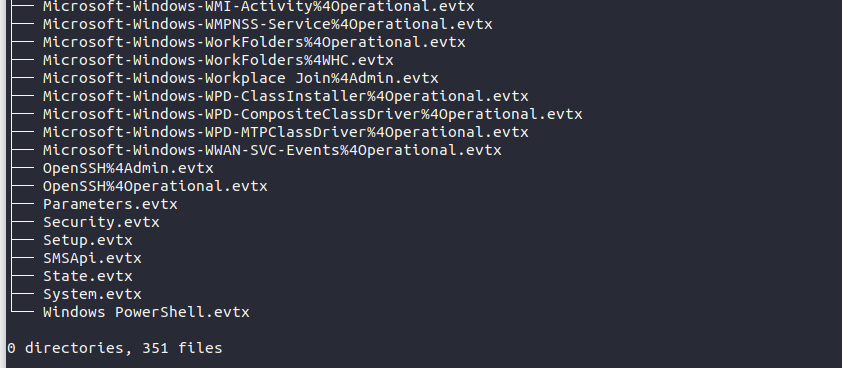
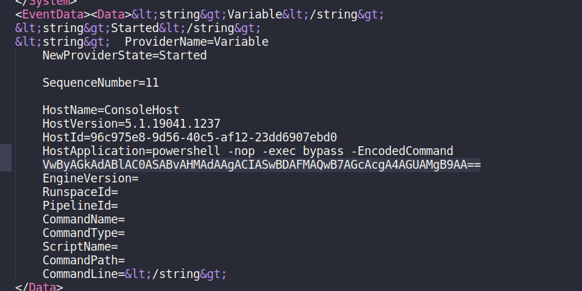
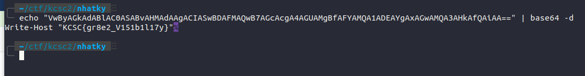
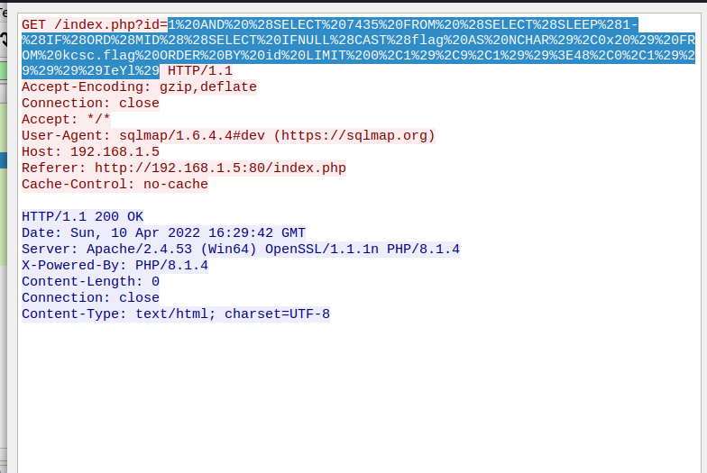
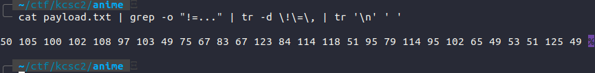
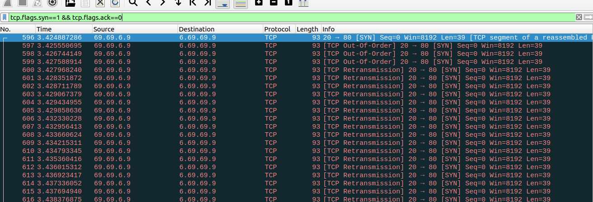
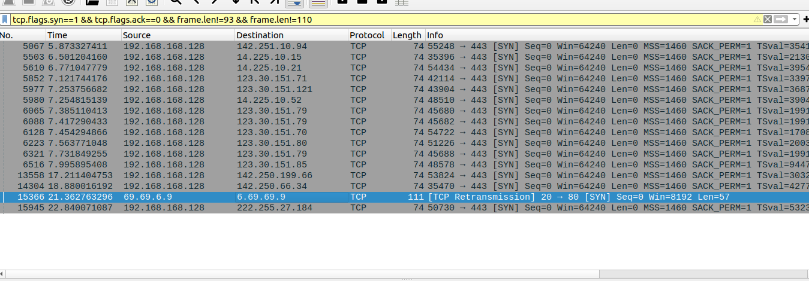

# Nhat ky cua me
source: [here](./src/Nhat-ky-cua-me/distfile.zip)

we have a bunch of .evtx files in logs. These are log files that contain events that were recorded by Microsoft Windows. And yes, these events file are very important bcs they sore every event that the system is configured to store and contain timestamps, facilitating the process of creating a timeline (based on these forensic artifacts) that track malicious activity that occurred on the system.



And the  specifically evtx file we need to pay attention to is ``Windows PowerShell.evtx``. This file stores PowerShell events, for example module logging is stored on this file. Also included in this .evtx file is Script block logging which will capture PowerShell code executed by an attacker

I will use [this](https://github.com/exti0p/ctf/blob/master/2021/SocVel/DFIR/evtx_dump.py) tool to dump all the data in the evtx file into xml format.

```
python3 ex.py logs/'Windows PowerShell.evtx' > test.xml
```



Here each command is encoded as b64. Our goal is to find the command that related to our flag.

And bingo: VwByAGkAdABlAC0ASABvAHMAdAAgACIASwBDAFMAQwB7AGcAcgA4AGUAMgBfAFYAMQA1ADEAYgAxAGwAMQA3AHkAfQAiAA==



# Try Alime
source: [here](./src/Try-Alime/log.pcap)

This challenge is about SQLi attack analysis (specifically time-based).



Here its query will perform bruteforce for each index value until it is true (aka !=).

First extract all the data using tshark

```
tshark -r log.pcap -T text > payload.txt
```

We will do urldecode for that log file to make it easier to find. We will do some filter to parse this out:

To grep 3 letter after ``!=``:
```
cat payload.txt | grep -o "!=..."
``` 

To remove ``!=``  and any comma:
```
tr -d \!\=\,
```

To convert from ``\n`` to ``space``:
```
tr '\n' ' '
``` 

final payload:
```
cat payload.txt | grep -o "!=..." | tr -d \!\=\, | tr '\n' ' '
```



flag: ``KCSC{Trv3_Or_fA153}``

# Flood
- Filter all the SYN packet



- Filter packets that have lengths of 93 and 110 



And we have this seemingly encrypted string of text:  ``NB2HI4DTHIXS64DBON2GKYTJNYXGG33NF5LWMRLHKNDUYRQ``

After identifying it with cipher-identifier it turned out to be base32. Decode that then we'll have :
`` https://pastebin.com/WfEgSGLF``

flag: ``KCSC{W3lc0m3_T0_7h3_aby$s_https://www.imperva.com/learn/ddos/syn-flood}``
