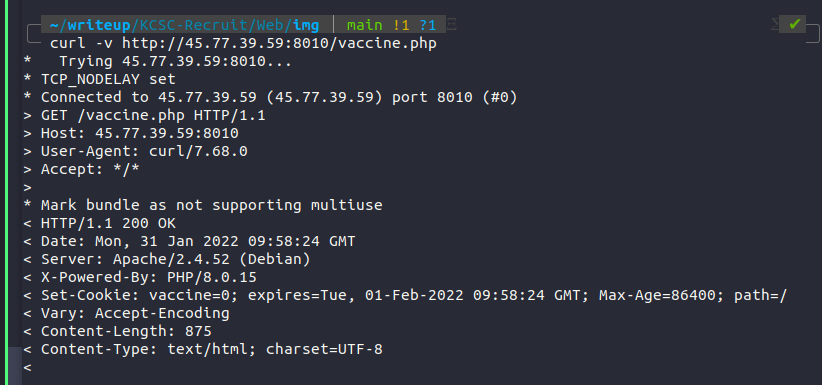

# 1. Robot
Bài này theo thể loại scavenger hunt. Trước tiên, check sourcecode thử thì thấy luôn part 1 **KCSC{C0r0n4_**. tiếp theo, theo như title , ta vào thử robots.txt xem có gì hot. Thì có luôn part 2 **v1ru22_1s_** và 1 đường path bị disallow: /vaccine.php, chui vào nghịch luôn.


Ban đầu thấy con trâu hay con bò ôm cái cột đường này
mình liên tưởng đến xml.map nma lại kphai :V. Sau 1 hồi check hết các thư mục khả nghi như: .htaacess,.htapasswd,.DS_Store nhưng k được gì sau đấy mình mới check thử các header xem sao



thì thấy chưa tiêm vaccine thật :vv. Phải tiêm vaccine để lấy cờ thoy
```
curl -v --cookie "vaccine=1" http://45.77.39.59:8010/vaccine.php
```
**Part 3 : g0n3_n0w!!}**

flag: KCSC{C0r0n4_v1ru22_1s_g0n3_n0w!!}

# 2. Warm Up
check source: 
```
const checkPassword = () => {
      const v = document.getElementById("password").value;
      const p = Array.from(v).map(a => 0xCafe + a.charCodeAt(0));
      if(p[0] === 52043 &&
         p[6] === 52063 &&
         p[5] === 52075 &&
         p[16] === 52076 &&
         p[9] === 52067 &&
         p[10] === 52063 &&
         p[4] === 52041 &&
         p[3] === 52067 &&
         p[8] === 52080 &&
         p[7] === 52037 &&
         p[2] === 52073 &&
         p[11] === 52082 &&
         p[12] === 52031&&
         p[13] === 52069 && 
         p[14] == 52063 && 
         p[15] == 52071 && 
         p[1] == 52063) {
        window.location.replace(v + ".html");
      } else {
        alert("Wrong password!");
      }
    }
```

mỗi giá trị của phần tử p đưọc tính bằng tổng gtri decimal của 0xCafe và thứ tự char đầu tiên trong bảng mã unicode. Việc cần làm giờ là lấy đúng posittion từng phần tử và trừ đi gtri decimal của 0xCafe (51966)

**p = MakeKmaGreatAgain**

flag: KCSC{j4v-a-SRript-i555-FUn}

# 3. D I O R
Nhìn là biết DIOR là chơi chữ của IDOR vul roài :v. Giờ bruteforce kiếm flag thôi
```
#!python3
import requests
url = 'http://45.77.39.59:8030/guess?number='
for i in range(100000):
   r=requests.get(url+str(i))
   if 'KCSC{' in r.text:
       print(r.text)
       break 
```

flag: KCSC{Gud_luckkkkk__brooo}

# 4. Magic PHP


Zo thử **flag here ?** xem có gì không thì đập ngay vào mặt là bức ảnh phát ra âm thanh :v


Nhưng check url có vẻ nó đang dùng hàm include. Thử test ngay 1 số payload LFI xem có gì hot không nàoo.


Thế còn wrapper filter thì sao


Trong lúc đang diễn ra ctf thì mình đã bị vuớng ở đọan này, thay vì thử tiếp thêm payload thì mình lại đổi sang các chall khác để làm để ròi bỏ quên lun em này :(( . Sau giải nhờ hint của một ngưòi khác mà mình mới bt n filter case sensitive . Thử xem có dc ko 


it worked !!! 


Đúng thật :v nó tạo filter bằng strpos. Đọc tiếp trong login.php có gì ko nào 


Oi giòi , nhìn là bít bị loose compression rồi , bài này mình làm qua mấy lần rồi nên bâyh không bị chô ke khi gặp đoạn này nữa :v 

Nghĩ đơn giản thì n bị lỗi khi compare (0 = '0e12121312421') sẽ trả về True

more info (https://www.whitehatsec.com/blog/magic-hashes/)

Còn đến với password, nhận thấy đưọc mình có thể tự gửi thêm param password của mình lên và cho nó bằng với param pass để bypass

payload sẽ như sau : **user=0e1137126905&pass=1&password=1**

flag: KCSC{LFI_to_loose_comparison@@}

(Tiếc bài này thật :( nếu mà cố thêm tí nữa thì ôm đưọc gần 1k points về rồi)
