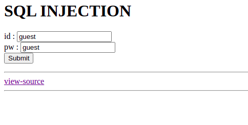
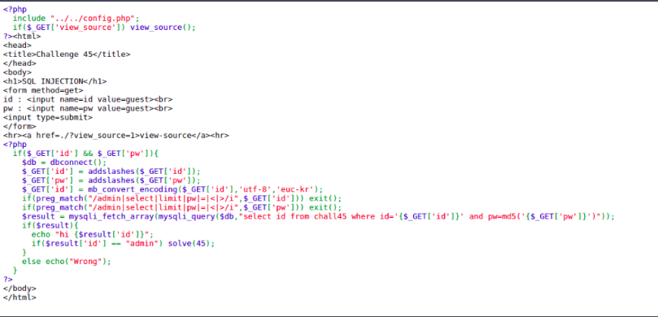
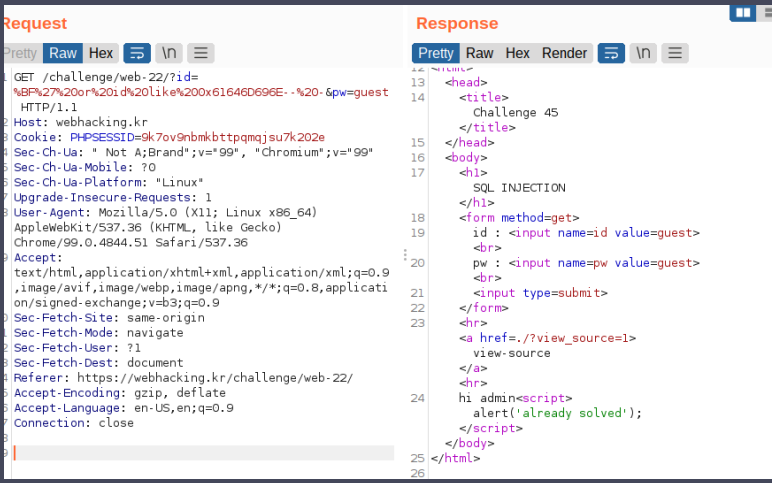
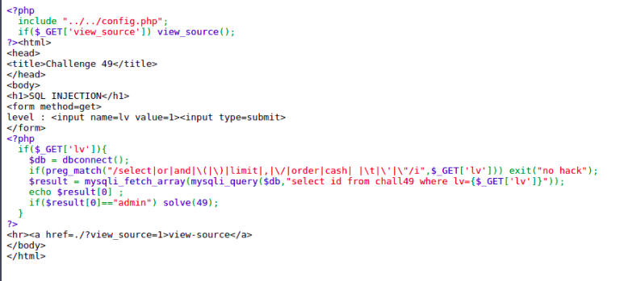
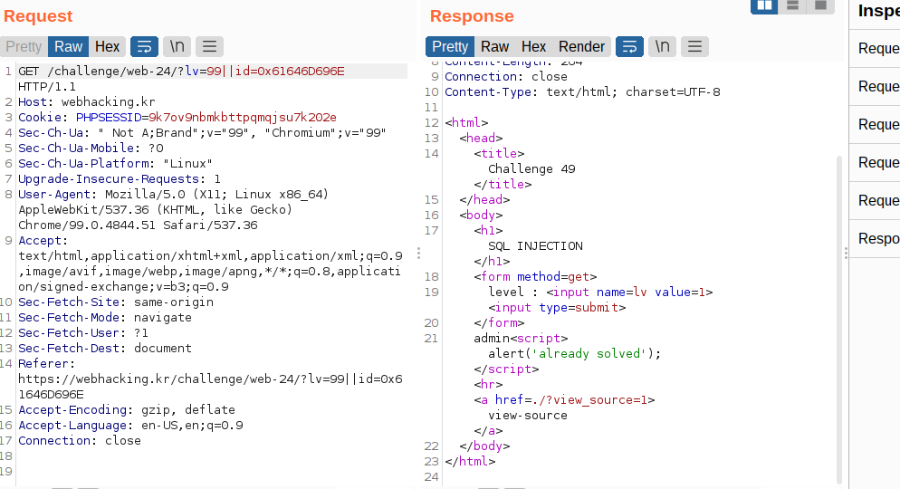

# Challenge
- [Challenge](#challenge)
- [old-45](#old-45)
  - [Solution](#solution)
- [old-49](#old-49)
  - [Solution](#solution-1)

# old-45
## Solution

Trong chall này mình có thể xem được source code:

Có 1 vài chỗ đáng chú ý trong src, tham số ta truyền vào đã được filter thông qua function ``addslashes()`` sau đó được convert từ euc-kr (mã euc giống với gbk) sang utf-8

Cụ thể hơn Hàm ``addslashes()`` có chức năng là sẽ thêm “\” vào trước những kí tự như dấu ‘ hoặc dấu “. Điều này sẽ khiến ta không thể sử dụng các câu truy vấn sql như trước. Vậy mấu chốt ở đây là phải làm sao để có thể bypass cái hàm này.

Quay lại với euc, Đây là mã unix mở rộng cụ thể là một multibyte được sử dụng cho tiếng trung,nhật,hàn,…. Tình huống ở đây là nếu payload của mình là ``%BF%27`` (aka ¿’ ), và nếu như payload này truyền qua hàm ``addslashes()``, kí tự \ (aka %5C) sẽ được thêm vào trước %27. điều này sẽ khiến cho payload mình như sau ``%BF%5C%27`` và theo như euc-kr, ``%BF%5C`` sẽ là 1 kí tự phù hợp (``縗``).

Việc còn lại giờ chỉ cần so sánh id với admin với payload like id='admin' là xong. nhưng mà khoan, thay vì so sánh với strings để rồi lại bị chèn thêm \ trước ‘ bởi ``addslashes()`` thì mình có thể biểu diễn ‘admin’ dưới dạng ``hex`` server đều hiểu được

final payload: ``%BF%27%20or%20id%20like%200x61646D696E--%20-``

# old-49
## Solution
Tương tự như chall trên, mình vẫn được xem source code:

Sau khi check sourcecode một hồi thì mình thấy chall này chỉ có 1 cách khai thác là phải bypass cái blacklist preg_match kia, nếu để ý kĩ, ta vẫn có thể sử dụng kha khá kí tự đặc biệt như ``&&`` và ``||``

vì ‘ nằm trong blacklist vậy lại giống như trên, ta sẽ convert string ‘admin’ sang hex và payload sẽ là: ``99||id=0x61646D696E``

