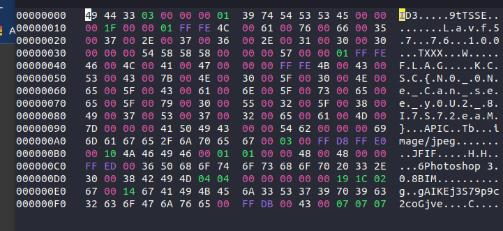
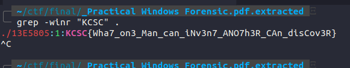
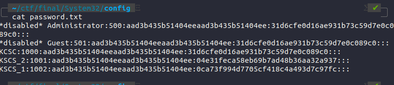

# 1. Metadata
## Description
C4n j00 h34r m3?

Author: 51LV3R KN16H7 KM4

## Solution
Nhìn qua file mp3 này thì việc đầu tiên mình nghĩ đến là dùng audacity để phân tích :v nhưng mà nghĩ lại đây là bài foren basic đầu tiên  nên mình nên thử truớc bằng 1 số command đơn giản hoặc một số tool để check param như là : strings , binwalk , exiftool, ...

Cụ thể trong thử thách thì mình đã chạy hexedit:
```
hexedit --color --sector C4n\ j00\ h34r\ m3.mp3
```

flag: KCSC{N0_0Ne_Can_see_y0U2_8I7S72eaM}

# 2. Recent Folders
## Description
Can you find the folder I opened most recently?

Author: 51LV3R KN16H7 KM4
## Solution
trong bài này mình sẽ đọc thông tin trong file NTUSER.DAT (đây là file lưu những inform mà user đã thực hiện hoặc thay đổi trong phiên đăng nhập của mình, khi mà đăng xuất thì windows sẽ tự động lưu các inform đó trong file này)
```
strings NTUSER.* > output.txt
```
flag : KCSC{We_knoW_wha7_J00_d1d_0n_J002_ComPv7e2_l4st_niGht}

# 3. PDF Analysis
## Description
Can you find the flag between these information?

Author: 51LV3R KN16H7 KM4
## Solution
bài này chỉ đơn giản dùng binwalk để extract hết dữ liệu có trong file pdf rồi dùng grep để kiếm flag thoy :V
```
binwalk -e Practical\ Windows\ Forensic.pdf
```


flag: KCSC{Wha7_on3_Man_can_iNv3n7_ANO7h3R_CAn_disCov3R}

# 4. p4ssw0rd
## Description
Can you get our user passwords that is located somewhere in our System32? :<

Author: 51LV3R KN16H7 KM4
## Solution
thông thuờng thì các credential thuờng đưọc lưu trong /system32/config/ cụ thể ở định dạnh SAM. Giờ ta chỉ dump cái file đó ra với samdump2 để lấy được các credential đó ở dạng hash
```
samdump2 SYSTEM SAM > password.txt
```


Thưòng thì LM- với NT-hash là cách để Windows lưu trữ mật khẩu. theo kinh nghiệm thì mình cũng đoán ra đuợc đây là dạng hash NTLM :vv. thì bây giờ ta có thể dùng john để crack đọan hash nay`
```
john --format=nt --wordlist=/home/qquang/SecLists/wordlist.txt password.txt
```
hoặc đơn giản hơn thì lên crackstastion :v : https://crackstation.net/

KCSC_1: who_knows

KCSC_2: your_password

flag: KCSC{who_knows_your_password}

