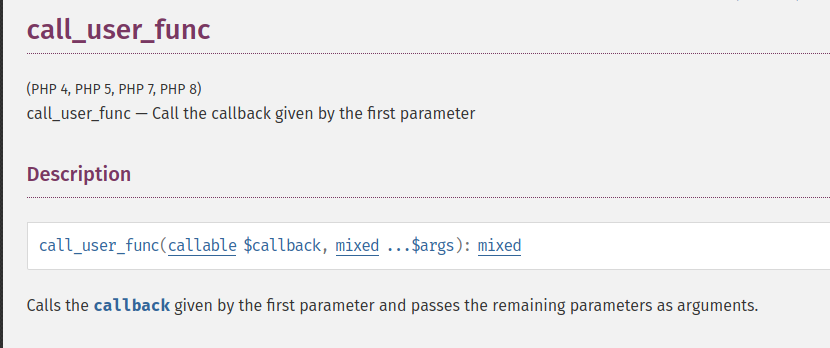
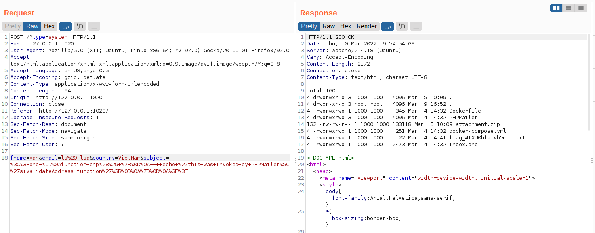

# [CTF] meu_lowf
## Description
I'm creating a mail server for my company please don't hack
## Solution
Vì mình có thể review hết đuợc sourcecode nên thấy ngay flag nằm ở cùng dict với index.php vậy mình đoán đây chắc phỉa là 1 chall RCE hoặc LFI. Truớc tiên xem qua ``index.php``:

```
<?php
	namespace PHPMailer;
	include "PHPMailer/PHPMailer/src/PHPMailer.php";
	
	$check = isset($_POST["fname"]) && isset($_POST["email"]) && isset($_POST["country"]) && isset($_POST["subject"]);
	$check2 = empty($_POST["fname"]) || empty($_POST["email"]) || empty($_POST["country"]) || empty($_POST["subject"]);

	if ($check && !$check2){

		$fullname = $_POST["fname"];
		$email = $_POST["email"];
		$country = $_POST["country"];
		$subject = $_POST["subject"];
		$type = "";
		if (isset($_GET["type"])){
			$type = $_GET["type"];
		}

		
		$is_valid_email = PHPMailer\PHPMailer::validateAddress($email,$type);
			if($is_valid_email!==True){
			$resp = "<script>alert('Oh no wrong email!\\n ErroR:".$is_valid_email."');</script>";
		}
		else{
			$resp = "Do mình lười nên không code nữa đâu :( ";
		}

	}
?>

<!DOCTYPE html>
<html>
<head>
<meta name="viewport" content="width=device-width, initial-scale=1">
<style>
body {font-family: Arial, Helvetica, sans-serif;}
* {box-sizing: border-box;}

input[type=text], select, textarea {
  width: 100%;
  padding: 12px;
  border: 1px solid #ccc;
  border-radius: 4px;
  box-sizing: border-box;
  margin-top: 6px;
  margin-bottom: 16px;
  resize: vertical;
}

input[type=submit] {
  background-color: #04AA6D;
  color: white;
  padding: 12px 20px;
  border: none;
  border-radius: 4px;
  cursor: pointer;
}

input[type=submit]:hover {
  background-color: #45a049;
}

.container {
  border-radius: 5px;
  background-color: #f2f2f2;
  padding: 20px;
}
</style>
</head>
<body>

<h3>Contact Form</h3>

<div class="container">
  <form action="" method="POST">
    <label for="fname">First Name</label>
    <input type="text" id="fname" name="fname" placeholder="Your name.." required="">

    <label for="email">Email</label>
    <input type="text" id="email" name="email" placeholder="Your email.." required="">

    <label for="country">Country</label>
    <select id="country" name="country">
      <option value="VietNam">VietNam</option>
      <option value="KCSC">KCSC</option>
    </select>

    <label for="subject">Subject</label>
    <textarea id="subject" name="subject" placeholder="Write something.." style="height:200px" required=""></textarea>

    <input type="submit" value="Submit">
  </form>
</div>
<?php if(isset($resp)){echo "<b style=\"background-color: red;color: white;\">$resp</b>";}?>
</body>
</html>
```

Tóm tắt: Nó sử dụng thư viện ``PHPMailer`` và vì mình đưọc xem src nên biết cụ thể là v6.4.1. Tiếp theo ta có tất cả 5 param mà ta có thể inject đưọc là: ``fname``,``email``,``subject``,``country``,``type``, và có 1 dòng lệnh gọi đến thư viện:

``PHPMailer``:  ``$is_valid_email = PHPMailer\PHPMailer::validateAddress($email,$type);``.

 Research 1 hồi thì có vẻ bản PHPMailer này bị dính 2 quả CVE là  ``CVE-2021-34551`` và ``CVE-2021-3603``. Nhưng mà sau khi đọc POC về 2 lỗi này mình thấy không khả quan cho lắm, ngoại trừ ``CVE-2021-3603`` có nhắc về function  ``validateAddress`` và ta có thể abuse đuợc 2 param truyền vào function này. Để cụ thể hơn ta sẽ xem qua function đấy trong file ``PHPMailer.php``

```
    public static function validateAddress($address, $patternselect = null)
    {
        if (null === $patternselect) {
            $patternselect = static::$validator; // php
        }
        if (is_callable($patternselect)) {
            return call_user_func($patternselect, $address);
        }
        //Reject line breaks in addresses; it's valid RFC5322, but not RFC5321
        if (strpos($address, "\n") !== false || strpos($address, "\r") !== false) {
            return false;
        }
        switch ($patternselect) {
            case 'pcre': //Kept for BC
            case 'pcre8':
                /*
                 * A more complex and more permissive version of the RFC5322 regex on which FILTER_VALIDATE_EMAIL
                 * is based.
                 * In addition to the addresses allowed by filter_var, also permits:
                 *  * dotless domains: `a@b`
                 *  * comments: `1234 @ local(blah) .machine .example`
                 *  * quoted elements: `'"test blah"@example.org'`
                 *  * numeric TLDs: `a@b.123`
                 *  * unbracketed IPv4 literals: `a@192.168.0.1`
                 *  * IPv6 literals: 'first.last@[IPv6:a1::]'
                 * Not all of these will necessarily work for sending!
                 *
                 * @see       http://squiloople.com/2009/12/20/email-address-validation/
                 * @copyright 2009-2010 Michael Rushton
                 * Feel free to use and redistribute this code. But please keep this copyright notice.
                 */
                return (bool) preg_match(
                    '/^(?!(?>(?1)"?(?>\\\[ -~]|[^"])"?(?1)){255,})(?!(?>(?1)"?(?>\\\[ -~]|[^"])"?(?1)){65,}@)' .
                    '((?>(?>(?>((?>(?>(?>\x0D\x0A)?[\t ])+|(?>[\t ]*\x0D\x0A)?[\t ]+)?)(((?>(?2)' .
                    '(?>[\x01-\x08\x0B\x0C\x0E-'*-\[\]-\x7F]|\\\[\x00-\x7F]|(?3)))*(?2)\)))+(?2))|(?2))?)' .
                    '([!#-'*+\/-9=?^-~-]+|"(?>(?2)(?>[\x01-\x08\x0B\x0C\x0E-!#-\[\]-\x7F]|\\\[\x00-\x7F]))*' .
                    '(?2)")(?>(?1).(?1)(?4))*(?1)@(?!(?1)[a-z0-9-]{64,})(?1)(?>([a-z0-9](?>[a-z0-9-]*[a-z0-9])?)' .
                    '(?>(?1).(?!(?1)[a-z0-9-]{64,})(?1)(?5)){0,126}|\[(?:(?>IPv6:(?>([a-f0-9]{1,4})(?>:(?6)){7}' .
                    '|(?!(?:.*[a-f0-9][:\]]){8,})((?6)(?>:(?6)){0,6})?::(?7)?))|(?>(?>IPv6:(?>(?6)(?>:(?6)){5}:' .
                    '|(?!(?:.*[a-f0-9]:){6,})(?8)?::(?>((?6)(?>:(?6)){0,4}):)?))?(25[0-5]|2[0-4][0-9]|1[0-9]{2}' .
                    '|[1-9]?[0-9])(?>.(?9)){3}))\])(?1)$/isD',
                    $address
                );
            case 'html5':
                /*
                 * This is the pattern used in the HTML5 spec for validation of 'email' type form input elements.
                 *
                 * @see https://html.spec.whatwg.org/#e-mail-state-(type=email)
                 */
                return (bool) preg_match(
                    '/^[a-zA-Z0-9.!#$%&'*+\/=?^_`{|}~-]+@[a-zA-Z0-9](?:[a-zA-Z0-9-]{0,61}' .
                    '[a-zA-Z0-9])?(?:.[a-zA-Z0-9](?:[a-zA-Z0-9-]{0,61}[a-zA-Z0-9])?)*$/sD',
                    $address
                );
            case 'php':
            default:
                return filter_var($address, FILTER_VALIDATE_EMAIL) !== false;
        }
    }
```

Mấu chốt bài này là ở đây:

```
if (is_callable($patternselect)) {
    return call_user_func($patternselect, $address);
}
```



$patternselect ở đây sẽ call đến 1 function built in trong php và sẽ nhận $address là arguments của nó. Ở đây ta có thể khai thác thông qua func ``system()`` để thực hiện RCE ^^.



Readflag:

