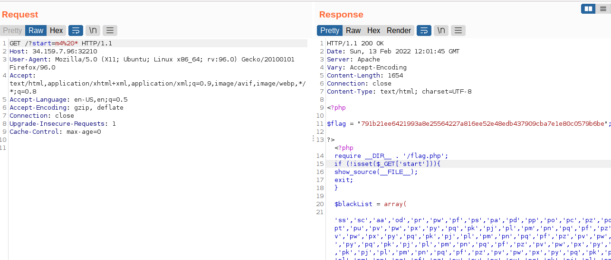

#  web-intro
## Description
Are you an admin?

Note: Access Denied is part of the challenge.

Flag format: CTF{sha256}
## Solution
Dùng burp để capture request 


Nhìn thoáng qua nó có vẻ giống format với json web token nên mình dùng thử [jwt.io](https://jwt.io/)  để decode thử. Sau khi decode, Headers nó có dạng:  ``{"logged_in": false}`` và payload có dạng ``"b\n\u0017O"``. 

Mình thử thay đổi sang **True** và send lại request thì có vẻ gặp bug


Mình có thể trace theo cái error để khai thác tiếp nma có 1 cái đáng để chú ý chính là nó có mention đến ``flask``.  Đến đấy thì mình ngh nó dùng flask server và phỉa dùng đến flask-unsign để decode tìm secret. (Và với cả nó kphai là jwt vì theo mình nghĩ phải có ``Authorizaiton Bearer``)

Tham khảo:

1. https://niithanoi.edu.vn/flask-la-gi.html

2. https://book.hacktricks.xyz/pentesting/pentesting-web/flask


flag: CTF{66bf8ba5c3ee2bd230f5cc2de57c1f09f471de8833eae3ff7566da21eb141eb7}

# para-code
## Description
I do not think that this API needs any sort of security testing as it only executes and retrieves the output of ID and PS commands.

Flag format: CTF{sha256}
## Solution

```
<?php
require __DIR__ . '/flag.php';
if (!isset($_GET['start'])){
    show_source(__FILE__);
    exit;
} 

$blackList = array(
  'ss','sc','aa','od','pr','pw','pf','ps','pa','pd','pp','po','pc','pz','pq','pt','pu','pv','pw','px','py','pq','pk','pj','pl','pm','pn','pq','pf','pz','pv','pw','px','py','pq','pk','pj','pl','pm','pn','pq','pf','pz','pv','pw','px','py','pq','pk','pj','pl','pm','pn','pq','pf','pz','pv','pw','px','py','pq','pk','pj','pl','pm','pn','pq','pf','pz','pv','pw','px','py','pq','pk','pj','pl','pm','pn','pq','pf','pz','pv','pw','px','py','pq','pk','pj','pl','pm','pn','pq','pf','pz','pv','pw','px','py','pq','pk','pj','pl','pm','pn','pq','pf','pz','pv','pw','px','py','pq','pk','pj','pl','pm','pn','pq','pf','pz','pv','pw','px','py','pq','pk','pj','pl','pm','pn','pq','pf','pz','pv','pw','px','py','pq','pk','pj','pl','pm','pn','pq','pf','pz','pv','pw','px','py','pq','pk','pj','pl','pm','pn','pq','pf','pz','pv','pw','px','py','pq','pk','pj','pl','pm','pn','pq','pf','pz','pv','pw','px','py','pq','pk','pj','pl','pm','pn','pq','pf','pz','pv','pw','px','py','pq','pk','pj','pl','pm','pn','pq','ls','dd','nl','nk','df','wc', 'du'
);

$valid = true;
foreach($blackList as $blackItem)
{
    if(strpos($_GET['start'], $blackItem) !== false)
    {
         $valid = false;
         break;
    }
}

if(!$valid)
{
  show_source(__FILE__);
  exit;
}

// This will return output only for id and ps. 
if (strlen($_GET['start']) < 5){
  echo shell_exec($_GET['start']);
} else {
  echo "Please enter a valid command";
}

if (False) {
  echo $flag;
}

?>
```

Ban đầu sau khi đọc qua sourcecode , mình có ý tuởng là dùng symbol để bypass cái blacklist này, nma rút gọn hết cỡ thì payload của mình vẫn cần đến 5 char ( payload: ``n\l%20*``), không thoả mãn ``strlen < 5``. Sau khi đuợc 1 bạn hint cho thì hóa ra có 1 command nữa của linux có display content chính là **m4**



flag: CTF{791b21ee6421993a8e25564227a816ee52e48edb437909cba7e1e80c0579b6be}


# casual-defence
## Description
In light of recent events related to the cyber attack, we have prepared a mirror environment of the defaced website so you can have a look. Moreover, both the mirror and production environments retain a copy of the defacement file and up-to-date security policies that prevent any access to our systems.

Flag format: CTF{sha256}
## Solution


Nhìn thì có vẻ không có gì để khai thác, nên mình thử 1 số fuzzing xem thế nào. Sau khi dùng thử dirsearch thì có vẻ ko có dict nào access đưọc, nên mình thử fuzz cả param.


đây dồiii!!. Như tên param, mình thử 1 số command như ``phpinfo()`` nhưng ko cgi xảy ra. nma ai ngờ đuợc nếu ta thêm ``;`` thì n sẽ trả về . ( chắc chắn là eval rồi ..)


Hàm eval thuờng có cú pháp là :

```
eval ( string $code ) :mixed
```
**Evaluate a string as PHP code**

Nôm na thì ta có thể exploit thông qua cái hàm này nếu input cho hàm này ko đuợc sanitized kĩ. Vì ko thấy đưọc filter hay blacklist của chall này là gì, nên mình truớc tiên sẽ thử 1 pp mà mình hay dùng chính là dùng ~ để reverse string.(Đại khía nó sẽ đảo nguợc char thành 1 char khác ko thể readable).

```
If the operand for the ~ operator is a string, the operation will be performed on the ASCII values of the characters that make up the string and the result will be a string, otherwise the operand and the result will be treated as integers.
```
Tham khảo thêm ở [đây](https://www.php.net/manual/en/language.operators.bitwise.php)


Vậy, Payload của mình sẽ là:  ``(~%8D%9A%9E%9B%99%96%93%9A)(~%96%91%9B%9A%87%D1%8F%97%8F);``

aka: ``(readfile)("index.php")`` bằng với ``readfile("index.php")``


flag: CTF{40c7bf1cd2186ce4f14720c4243f1e276a8abe49004b788921828f13a026c5f1}