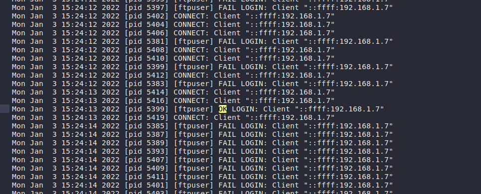
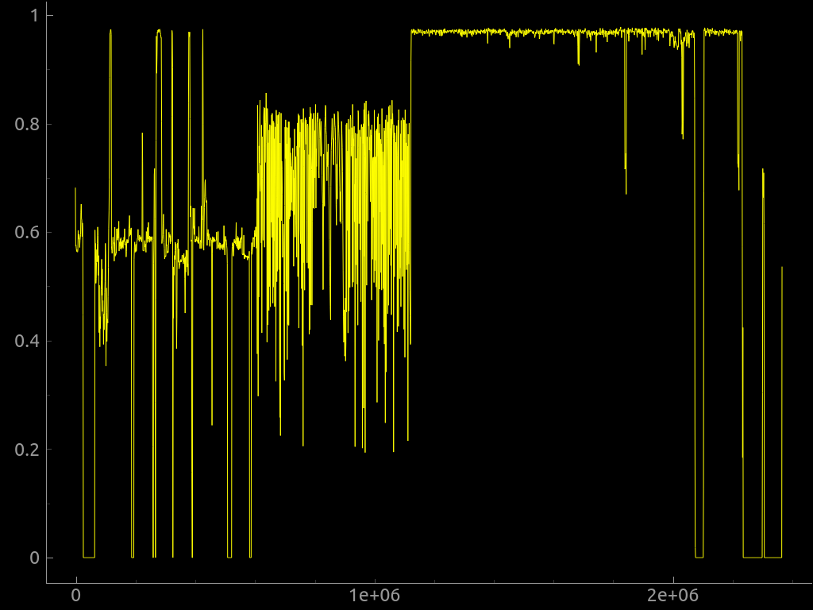

# The Lost Flag
## Description
We recovered a image file from an incident. There might be something interesting in the file. Give it a try.
## Solution
Use stegsolve

**flag: KCTF{Y0U_F0uNd_M3}**
# Compromised FTP
## Description
We detected some malicious activity on our FTP server. Someone has performed bruteforce attack to gain access to our FTP server. Find out the Compromised FTP account username & the attacker IP from the following.
## Solution
Its not that hard to find the correct user. Simply we just find some word that synonym with 'success'




**flag: KCTF{ftpuser_192.168.1.7}**

# Unknown File
## Description
My friend sent me a file & told me there is a flag in it. He dare me to find the flag. But I have no idea what the file is about. Can you help me get the flag?
## Solution
unzip that file and enumerate the data file.
i found out something special in hex form of that file that its have strings "IHDR" which means it's normally PNG type. So we edit the first 4 byte **89 50 4e 47** (it's called magic number)
more info: https://gist.github.com/leommoore/f9e57ba2aa4bf197ebc5


# Let's Walk Together
## Description
Do you know anything about this image?



## Solution
Use binwalk 
```
binwalk -e interesting_waves.pn
```
We got a zip file and file Flag (but nothing in there)
we cant unzip that zip file because it needs password. So... Bruteforce it !!!!
Simply use john
```
john-the-ripper.zip2john 11150.zip > pass.txt 
```
And then brute force the zip file with that **pass.txt** and with rockyou.txt (very famous wordlist)

**flag: KCTF{BiNw4lk_is_h3lpfUl}**