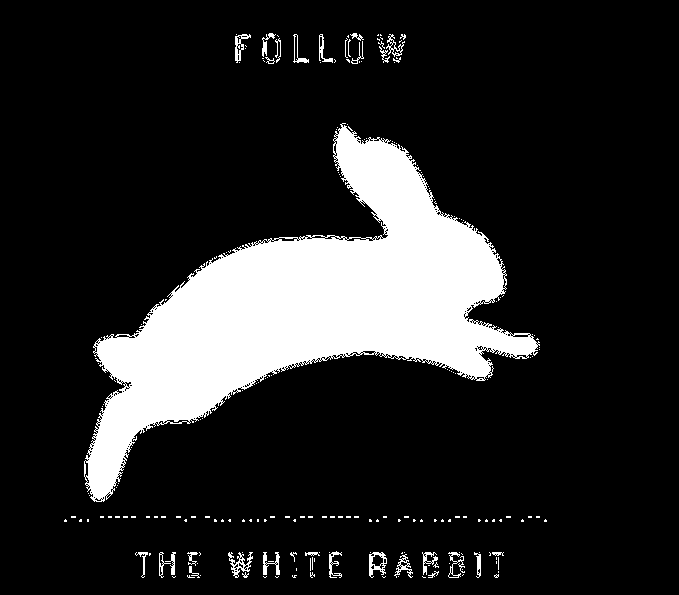

# FileD
Use **krita**

KCTF{W00_n1ce_you_got_me}

# Follow The White Rabbit

## Description
Will you choose to follow the white rabbit like NEO? THINK wisely or LOOK your path deeply before you take step.

## Solution
Use **stegsolve**
We will get mourse code



decode that nasty thing to get flag:

**KCTF{L0OKB4Y0UL34P}**

# Follow
## Description
Follow the rules ?
## Solution
the color of the flag is the same with the template. Just copy the test and move somewhere to see the flag

**flag: KCTF{This_is_the_real_flag}**

# QR Code From The Future
## Description
The following file was found in a device from a crashed UFO. Can you solve that mystery?
## Solution
Convert gif to PNGs and we will scan all of it. But im to lazy to grab my phone to scan so i wrote a script for it ^^

We'll scan it with imagick
```
convert QR_Code_From_The_Future.gif new.png
```
And ran the script(i put it in script file). Then we will get this text:
```
}pvznalq_bg_pvgngf_zbes_qriybir_gbt_rqbp_ED{SGPX
```
After reverse that and dcode with ceasar we will get the 
flag:

**flag: KCTF{QR_code_got_evolved_from_static_to_dynamic}**

# Bangladesh
## Description
My friend John was interested to know my country . He told me that to give him some images and articles about my county . I gave him some images and articles. In one image I provided some hidden data but he can not find hidden data . I told him Always remember 3 number sum equal to a game-changer. but he can not find hidden data . For that reason, I gave him that game-changer key.
## Solution
simple, we use stegseek
```
stegseek --crack Bangladesh.jpg ~/SecLists/rockyou.txt pass.txt
```

**flag: KCTF{Do_We_Remember_Cicada_3301}**