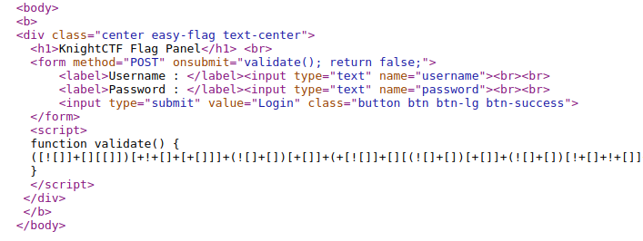
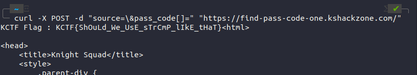

# Sometime you need to look wayback
## Description
Flag Format : KCTF{something_here}
Note : Burte Force/Fuzzing not required and not allowed.

Author: 0xmahi
## Solution
So first of all, we always should pay attention to the source code

notice that there is a comment:

```
<--Test Bot Source Code: https://github.com/KCTF202x/repo101--> 
```
 
Let's go to the repo and see the commits

<br>

**flag: KCTF{version_control_is_awesome}**
<br><br>

# Do Something Special
## Description
Alex is trying to get a flag from this website. But something is wrong with the button. Can you help him to get the flag?
Note : Burte Force/Fuzzing not required and not allowed.

Flag Format: KCTF{S0M3_TEXT_H3R3}

Author: marufmurtuza

## Solution
Check source code and we could see this strange thing:

```
<a href="/gr@b_y#ur_fl@g_h3r3!" class="button btn btn-lg btn-success">Get the flag!</a>
```
We cant access that path because the url cant understand those special symbols.
So what we need to do here is encode that path to url and thats all.

**flag: KCTF{Sp3cial_characters_need_t0_get_Url_enc0ded}**

# Obsfuscation Isn't Enough
## Description
One of my friend developed this login panel and dared me to get the flag by logging in. I tired to bruteforce the login panel. But it doesn't work at all. Can you please figure out the login credentials or something more valuable for me?

Author: marufmurtuza

Flag Format: KCTF{S0M3_TEXT_H3R3}

## Solution
Sourcecode again,there is something special here: JSF*CK!



We can decode that with dcoder.fr or with this website: https://wishingstarmoye.com/ctf/jsencode/jsfuck
```
if (document.forms[0].username.value == "83fe2a837a4d4eec61bd47368d86afd6" && document.forms[0].password.value == "a3fa67479e47116a4d6439120400b057") document.location = "150484514b6eeb1d99da836d95f6671d.php"
```
so basiclly it says that if we input to the form with that correct string then we can access to the **150484514b6eeb1d99da836d95f6671d.php** (but instead, we can straight go to that file,LOL no need to try logging .)

**flag: KCTF{0bfuscat3d_J4v4Scr1pt_aka_JSFuck}** 

# Zero is not the limit
## Description
Flag Format : KCTF{s0m3thing_h3r3}

Note : Burte Force/Fuzzing not required and not allowed. Hint: You have to think out side from '/user/'.

Author: 0xmahi

## Solution
this's really easy chall. all we need to do is access to **/user/-1** (Just a little bit deduction from the description)

**flag: KCTF{tHeRe_1s_n0_l1m1t}** 

# Find Pass Code - 1
## Description
Flag Format : KCTF{something_here}

Note : Burte Force/Fuzzing not required and not allowed.

Author: NomanProdhan

## Solution
In sourcecode, there is a comment:
```
<!-- Hi Serafin, I learned something new today. 
I build this website for you to verify our KnightCTF 2022 pass code. You can view the source code by sending the source param
-->
```
So could see the source code by adding the param source like this: **/?source=**

There's something quite special in the sourcecode 
```
if (strcmp($_POST["pass_code"], $flag) == 0 ) {
        echo "KCTF Flag : {$flag}";
    } else {...
```
After a bit more research, it seemed that strcmp had some issues when comparing a string to something else. If we set $_POST['pass_code'] equal to an empty array, then strcmp would return a **NULL** and the interesting path is **NULL==0 will return True**!. )

More info about this: http://www.dimuthu.org/blog/2008/10/31/triple-equal-operator-and-null-in-php/



**flag: KCTF Flag : KCTF{ShOuLd_We_UsE_sTrCmP_lIkE_tHaT}**

# Find Pass Code - 2
## Description
Flag Format : KCTF{something_here}

Note : Burte Force/Fuzzing not required and not allowed.

Author: NomanProdhan
## Solution
Same with the first chall, we can see the source code by adding param soucrce . but this time the chall method is a little bit harder. Here the source:
```
<?php
require "flag.php";
$old_pass_codes = array("0e215962017", "0e730083352", "0e807097110", "0e840922711");
$old_pass_flag = false;
if (isset($_POST["pass_code"]) && !is_array($_POST["pass_code"])) {
    foreach ($old_pass_codes as $old_pass_code) {
        if ($_POST["pass_code"] === $old_pass_code) {
            $old_pass_flag = true;
            break;
        }
    }
    if ($old_pass_flag) {
        echo "Sorry ! It's an old pass code.";
    } else if ($_POST["pass_code"] == md5($_POST["pass_code"])) {
        echo "KCTF Flag : {$flag}";
    } else {
        echo "Oh....My....God. You entered the wrong pass code.<br>";
    }
}
if (isset($_GET["source"])) {
    print show_source(__FILE__);
}
```
Note that there is a loose comparision in the code and we can take advantage of that by doing some magic hash trick or hash collision.

more info: https://www.whitehatsec.com/blog/magic-hashes/

So the idea here is enter the string that would hash to 0e6545579642. Because PHP will assume that is a number follwed by a bunch of numbers . And Because of loose comparision, PHP will read that. (simple explanation is 0 = '0e325235326236')

i had wrote a script to do that for us. (in the script folder). Just run it then we can get the correct $_POST['poss_code'].

** 0e1137126905 : 0e291659922323405260514745084877 **

**flag: KCTF{ShOuD_wE_cOmPaRe_MD5_LiKe_ThAt__Be_SmArT}**

# Most Secure Calculator - 1
## Description
Flag Format : KCTF{something_here}

Note : Burte Force/Fuzzing not required and not allowed.

Author: NomanProdhan

## Solution
After a long while research, i found out that we can bypass this chall simply call out this command **system()**


**flag: KCTF{WaS_mY_cAlCuLaToR_sAfE}**

# Can you be Admin?
## Description
Be Admin & get the Flag.

Note : Burte Force/Fuzzing not required and not allowed.

Flag Format: KCTF{S0m3_T3xt_Here}

Author: TareqAhmed

## Solution
when you see a message like this after you access to the page:
> Only KnightSquad agents can access this page.

 It's all about adding and modifying the header. So the first thing need to be added is "**User-Agent: KnightSquad**". After doing that, the second message is:
 >This page refers to knight squad home network. So, Only Knight Squad home network can access this page.
 
 By adding "**Referer: localhost**" and send request, now we can have the login page. One thing we can do here is check the sourcecode and there it is, JSf*ck again.
 Decode that nasty thing then we can get this message:
 
 > F`V,7DIIBn+?CWe@<,q!$?0EpF*DPCA0<oU8RZI/DJ<`sF8

In my experience, i found out that this string could be encode to base91 or base85. and yeah, after decode that nasty thing, we get this message:

>username : tareq
>password : IamKnight

Lets Login!!

Not admin, ofcourse it can't be easy like that. After checking the cookies, we note that the cookies can be modified

> VXNlcl9UeXBl:Tm9ybWFsX1VzZXI%3D

Its definitely Base64. Decode that thing and change it to **admin** (with the correct form) then send request againt and then we can finally get the flag:

**flag: KCTF{FiN4LlY_y0u_ar3_4dm1N}**

# My PHP Site
## Description
Try to find the flag from the website.

> N:B: I'm a n00b developer.

Website Link

Note : Burte Force/Fuzzing not required and not allowed.

Flag Format: KCTF{S0m3_T3xt_H3re}

Author: TareqAhmed

## Solution

The interesting in this chall is :
```
http://137.184.133.81:15002/?file=index.html 
```
Yeah it is definitely LFI vulnerable.

More info: https://book.hacktricks.xyz/pentesting-web/file-inclusion

after trying little bit, we can finally read the index.php by adding the filter method.
```
http://137.184.133.81:15002/?file=php://filter/convert.base64-encode/resource=index.ph
``` 
Then we will get index.php in base64 form.
Decode that nasty thing and here is the code:
``` 
<?php

if(isset($_GET['file'])){
    if ($_GET['file'] == "index.php") {
        echo "<h1>ERROR!!</h1>";
        die();
    }else{
        include $_GET['file'];
    }

}else{
    echo "<h1>You are missing the file parameter</h1>";

    #note :- secret location /home/tareq/s3crEt_fl49.txt
}

?>

<!DOCTYPE html>
<html lang="en">
<head>
    <meta charset="UTF-8">
    <meta http-equiv="X-UA-Compatible" content="IE=edge">
    <meta name="viewport" content="width=device-width, initial-scale=1.0">
    <title>Tareq's Home Page</title>
</head>
<body>
</body>
</html>
``` 
yay we get some notes: **#note :- secret location /home/tareq/s3crEt_fl49.txt**

But when i tried to access to that path, it's not working... and thanks to my friend he said that the hint is in the description and it's relatif path and not the full path.
So the path we need to go to is **/s3crEt_fl49.txt**.

**flag:KCTF{L0C4L_F1L3_1ncLu710n}**

# Most Secure Calculator - 2
## Description
Flag Format : KCTF{something_here}

Note : Burte Force/Fuzzing not required and not allowed.

Author: NomanProdhan

## Solution
Octal Encoding.
payload:
```
("\163\171\163\164\145\155")("\143\141\164 *")
```

**flag: KCTF{sHoUlD_I_uSe_eVaL_lIkE_tHaT}**
